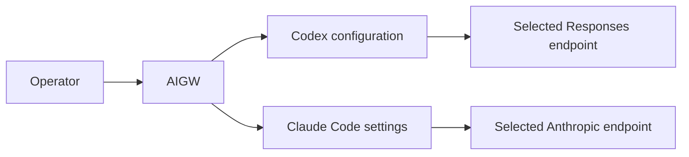
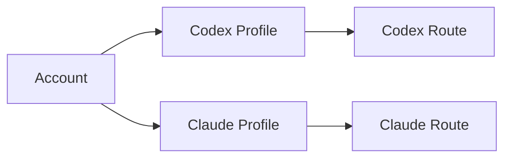
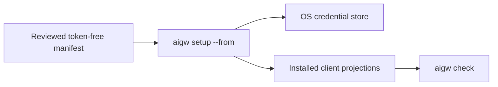

# AIGW CLI

A local-first control plane for teams using reviewed third-party AI services.

AIGW manages Accounts, Tokens, Profiles, Routes, and native client projections.
It does **not** relay model traffic, run a gateway, or own conversation state.

| GitLab metadata | Value |
| --- | --- |
| **Project Name** | `AIGW CLI` |
| **Stable repository Path** | `aigw-cli` |



## Start here

| Goal | Command | Next step |
| --- | --- | --- |
| Connect the first service | `aigw setup` | `aigw check` |
| Inspect the active selection | `aigw` | Follow **Next** |
| Select a profile | `aigw use <profile>` | `aigw check` |
| Replace an Account Token | `aigw rotate <account>` | `aigw check` |
| Diagnose local integration | `aigw doctor` | Run its recommended action |
| Import reviewed team settings | `aigw setup --from team.toml` | Connect any one Account when needed |

The daily path is deliberately small:

```text
aigw setup
aigw use
aigw check
```

Advanced object management remains under explicit command groups.

## Install

Install the checksum-verified archive matching the host from either independent
release plane: `darwin_amd64`, `darwin_arm64`, `linux_amd64`, `linux_arm64`,
`windows_amd64`, or `windows_arm64`.

A portable archive contains only the executable, README, and license. Run the
executable once to install it in the platform's user program directory:

```bash
./aigw install
```

```powershell
.\aigw.exe install
```

The default is `~/.local/bin/aigw` on macOS and Linux, and the AIGW user-program
directory on Windows. An explicit destination is available for isolated use:

```bash
./aigw install --target /path/to/aigw
```

```powershell
.\aigw.exe install --target C:\path\to\aigw.exe
```

`aigw install` copies only the running executable and retains one predecessor
for rollback. It does not edit shell startup files, retrieve a release, store
credentials, configure clients, or start another product. `aigw uninstall`
removes only the installed executable and that rollback copy; configuration and
credential-store secrets remain intact.

GitLab and GitHub publish independently. Either release plane may supply a
verified installation. When both are reachable during update, AIGW requires
their version and current-platform asset bytes to agree; it never combines
assets from different Forges.

## Connect a service

Interactive setup creates one Account, one Profile, one Route, and one
operating-system Token slot:

```bash
aigw setup
```

A team can distribute a reviewed, token-free manifest:

```bash
aigw setup --from team.toml
```

Start from [`manifests/team.toml`](manifests/team.toml). It contains the
reviewed team Accounts, Profiles, and recommended Routes, but no Token or
workstation-specific client path. Import does not require a Token or an
installed client, so the same file works for a new workstation and for a
machine where Claude Code or Codex will be installed later.

To connect one Account while importing, name its manifest ID. Other Accounts
remain available without becoming setup requirements:

```bash
aigw setup --from team.toml --account dmxapi
```

For non-interactive automation, one stdin Token must have one explicit owner:

```bash
printf '%s\n' "$DMXAPI_TOKEN" \
  | aigw setup --from team.toml --account dmxapi --token-stdin
```

If the catalogue was imported without a Token, connect an Account later and
select any of its Profiles:

```bash
aigw rotate dmxapi
aigw use dmxapi-gpt-5.6-sol --for codex
```

If a supported client is installed after setup, `aigw sync` discovers it and
creates only AIGW-owned projection state. Synchronization does not ask for or
replace a Token.

### Environment variables

Interactive users do not need environment variables. Use these only for
explicit automation or a deliberately selected secret backend:

| Variable | Meaning |
| --- | --- |
| `AIGW_SECRET_BACKEND=keyring` | Use the operating-system credential store (default): macOS Keychain, Windows Credential Manager, or Secret Service on Linux/BSD. |
| `AIGW_SECRET_BACKEND=env` | Read Tokens from the current process environment without persisting, rotating, or deleting them. Intended for CI and other controlled automation. |
| `AIGW_TOKEN_<ACCOUNT>` | Token for one manifest Account when `AIGW_SECRET_BACKEND=env`; uppercase the Account ID and replace each run of non-alphanumeric characters with `_` (for example, `dmx-api` becomes `AIGW_TOKEN_DMX_API`). |
| `AIGW_ACCESSIBLE=1` | Use accessibility-oriented terminal output. |
| `AIGW_GITLAB_RELEASE_ORIGIN` + `AIGW_GITLAB_RELEASE_REPOSITORY` | Override the GitLab update source as one complete `HTTPS origin + namespace/project` pair. |
| `AIGW_GITHUB_RELEASE_ORIGIN` + `AIGW_GITHUB_RELEASE_REPOSITORY` | Override the GitHub update source as one complete `HTTPS origin + owner/repository` pair. |
| `AIGW_GITHUB_TOKEN`, `GITHUB_TOKEN`, or `GH_TOKEN` | Authenticate a private GitHub release lookup; checked in this order and never persisted. |
| `GITLAB_TOKEN` | Authenticate a private GitLab release lookup when `glab` credentials are unavailable; requires an explicit GitLab origin. |

Release-origin and Forge-token variables belong to contributor and release
operations, not normal product setup. Built-in official release coordinates
remain the default; overrides replace a complete source tuple rather than
partially combining sources. See [CONTRIBUTING](CONTRIBUTING.md).

AIGW configures only supported clients that are present. Missing clients remain
untouched and are reported as not configured.

## Use it every day

```bash
aigw
aigw use [profile]
aigw check
aigw doctor
aigw repair --dry-run --json
aigw repair
aigw rotate [account]
```

| Command | Purpose |
| --- | --- |
| `status` | Show selection, readiness, and one next action |
| `check` | Verify configuration, client projection, and endpoint passage |
| `doctor` | Explain a problem without mutation |
| `repair` | Reconcile bounded AIGW-owned client state |
| `test` | Test configured connectivity and authentication |
| `verify` | Make an explicit minimal model request that may consume quota |
| `rollback` | Restore AIGW-managed configuration only |

Human output is task-oriented and terminal-width aware. Automation uses stable
JSON flags where available. Expected failures do not emit tracebacks, warning
dumps, or unrelated usage text.

## Product model

| Entity | Owns | Does not own |
| --- | --- | --- |
| Account | Provider endpoints and one logical Token boundary | Client selection |
| Profile | `account + client + model` | Endpoint credentials |
| Route | Default or client-specific Profile selection | Provider fallback |
| Adapter | One native client projection | Another client's state |



The current admitted clients are:

- **Codex CLI and Codex Desktop**, which share one Codex Home;
- **Claude Code**, configured through its official user settings and credential-helper boundary.

Future clients require a new admitted adapter. They are not inferred from a
provider name and are not configured by the current release.

## Ownership boundaries

| Surface | Owner |
| --- | --- |
| Account metadata, Tokens, Profiles, Routes | AIGW |
| AIGW-marked Codex provider/model projection | AIGW |
| AIGW-owned Claude Code endpoint/model keys and credential helper | AIGW |
| Codex conversations, JSONL, SQLite, model metadata | Codex |
| Claude session behavior | Claude Code |
| External gateway or compatibility process | Its own product/operator |
| IDE and ACP configuration | The IDE or ACP product |

AIGW never edits Codex history or Desktop-only GUI state. A loopback endpoint is
an ordinary Account endpoint; AIGW does not start, stop, configure, or diagnose
the process listening there.

## Team rollout



Use [Team rollout](docs/guides/team-rollout.md) for manifest review, staged
adoption, and rollback. Tokens never enter the manifest or repository.

## Update and rollback

```bash
aigw update
aigw update --rollback
```

Every installation uses the same portable lifecycle and retains one immediate
predecessor. A verified offline candidate may be supplied explicitly with its
checksum manifest; source trees, loose binaries, tags, and self-authored
checksums are not installation evidence.

## Verify a source checkout

```bash
mise exec --locked -- go run ./tools/ci source
mise exec --locked -- go run ./tools/forge commits --email '<product author email>' --allowed-signers '<path>'
mise exec --locked -- go run ./tools/forge tags --allowed-signers '<path>'
```

## Documentation

| Need | Source of truth |
| --- | --- |
| Concepts | [Account, Profile, Route, Adapter](docs/concepts/product-concepts.md) |
| Client and control-plane boundaries | [Architecture](docs/architecture/authority-and-projection-boundary.md) |
| Human terminal behavior | [Terminal experience](docs/experience/terminal-experience.md) |
| Security | [Security model](docs/architecture/security-model.md) |
| Team adoption | [Team rollout](docs/guides/team-rollout.md) |
| Release evidence | [Release readiness](docs/evidence/release-evidence.md) |
| Development | [CONTRIBUTING](CONTRIBUTING.md) |
| Full index | [Documentation root](docs/README.md) |

Licensed under the MIT License: [MIT](LICENSE).
