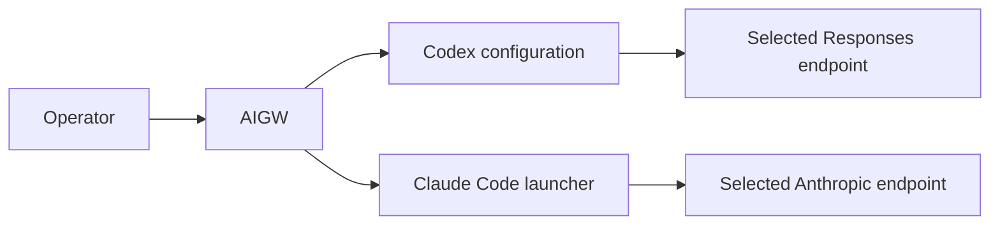
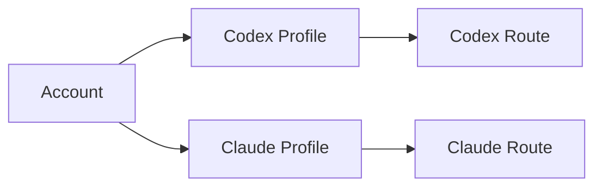
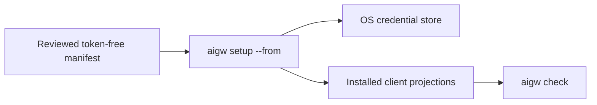

# AIGW CLI

A local-first control plane for teams using reviewed third-party AI services.

AIGW manages Accounts, Tokens, Profiles, Routes, and native client projections.
It does **not** relay model traffic, run a gateway, or own conversation state.

| GitLab metadata | Value |
| --- | --- |
| **Project Name** | `AIGW CLI` |
| **Stable repository Path** | `aigw-cli` |



## Start here

| Goal | Command | Next step |
| --- | --- | --- |
| Connect the first service | `aigw setup` | `aigw check` |
| Inspect the active selection | `aigw` | Follow **Next** |
| Select a profile | `aigw use <profile>` | `aigw check` |
| Replace an Account Token | `aigw rotate <account>` | `aigw check` |
| Diagnose local integration | `aigw doctor` | Run its recommended action |
| Import reviewed team settings | `aigw setup --from manifest.toml` | Supply missing Tokens |

The daily path is deliberately small:

```text
aigw setup
aigw use
aigw check
```

Advanced object management remains under explicit command groups.

## Install

Install a checksum-verified package or portable archive from either independent
release plane.

| Platform | Native package | Portable archive |
| --- | --- | --- |
| macOS | universal `.pkg` | `darwin_amd64` or `darwin_arm64` |
| Linux | `.deb` or `.rpm` | `linux_amd64` or `linux_arm64` |
| Windows | `.msi` | `windows_amd64` or `windows_arm64` |

A portable archive contains the executable and a local installer:

```bash
sh install.sh
```

```powershell
.\install.ps1
```

Automation and isolated installations can leave shell startup configuration
unchanged:

```bash
sh install.sh --no-path
```

```powershell
.\install.ps1 -NoPath
```

The installer copies only the bundled executable. It does not retrieve a
release, store credentials, configure clients, or start another product.

GitLab and GitHub publish independently. Either release plane may supply a
verified installation. When both are reachable during update, AIGW requires
their version and current-platform asset bytes to agree; it never combines
assets from different Forges.

## Connect a service

Interactive setup creates one Account, one Profile, one Route, and one
operating-system Token slot:

```bash
aigw setup
```

A team can distribute a reviewed, token-free manifest:

```bash
aigw setup --from manifest.toml
```

Start from [`manifests/example.toml`](manifests/example.toml). Product source
contains no real provider endpoint, model recommendation, Token, contributor
identity, or organization-specific Forge coordinate.

### Environment variables

Interactive users do not need environment variables. Use these only for
explicit automation or a deliberately selected secret backend:

| Variable | Meaning |
| --- | --- |
| `AIGW_SECRET_BACKEND=keyring` | Use the operating-system credential store (default). |
| `AIGW_SECRET_BACKEND=env` | Read token slots without writing them. |
| `AIGW_TOKEN_<ACCOUNT>` | Token for an account when the `env` backend is selected; never commit it. |
| `AIGW_ACCESSIBLE=1` | Use accessibility-oriented terminal output. |

Release-origin and Forge-token variables belong to contributor and release
operations, not normal product setup; see [CONTRIBUTING](CONTRIBUTING.md).

AIGW configures only supported clients that are present. Missing clients remain
untouched and are reported as not configured.

## Use it every day

```bash
aigw
aigw use [profile]
aigw check
aigw doctor
aigw repair --dry-run --json
aigw repair
aigw rotate [account]
```

| Command | Purpose |
| --- | --- |
| `status` | Show selection, readiness, and one next action |
| `check` | Verify configuration, client projection, and endpoint passage |
| `doctor` | Explain a problem without mutation |
| `repair` | Reconcile bounded AIGW-owned client state |
| `test` | Test configured connectivity and authentication |
| `verify` | Make an explicit minimal model request that may consume quota |
| `rollback` | Restore AIGW-managed configuration only |

Human output is task-oriented and terminal-width aware. Automation uses stable
JSON flags where available. Expected failures do not emit tracebacks, warning
dumps, or unrelated usage text.

## Product model

| Entity | Owns | Does not own |
| --- | --- | --- |
| Account | Provider endpoints and one logical Token boundary | Client selection |
| Profile | `account + client + model` | Endpoint credentials |
| Route | Default or client-specific Profile selection | Provider fallback |
| Adapter | One native client projection | Another client's state |



The current admitted clients are:

- **Codex CLI and Codex Desktop**, which share one Codex Home;
- **Claude Code**, launched through an AIGW-owned process boundary.

Future clients require a new admitted adapter. They are not inferred from a
provider name and are not configured by the current release.

## Ownership boundaries

| Surface | Owner |
| --- | --- |
| Account metadata, Tokens, Profiles, Routes | AIGW |
| AIGW-marked Codex provider/model projection | AIGW |
| Claude process-scoped endpoint and Token injection | AIGW |
| Codex conversations, JSONL, SQLite, model metadata | Codex |
| Claude session behavior | Claude Code |
| External gateway or compatibility process | Its own product/operator |
| IDE and ACP configuration | The IDE or ACP product |

AIGW never edits Codex history or Desktop-only GUI state. A loopback endpoint is
an ordinary Account endpoint; AIGW does not start, stop, configure, or diagnose
the process listening there.

## Team rollout



Use [Team rollout](docs/guides/team-rollout.md) for manifest review, staged
adoption, and rollback. Tokens never enter the manifest or repository.

## Update and rollback

```bash
aigw update
aigw update --rollback
```

Portable installations retain one immediate predecessor. Native package
rollback belongs to the platform package manager. A verified offline candidate
may be supplied explicitly with its checksum manifest; source trees, loose
binaries, tags, and self-authored checksums are not installation evidence.

## Verify a source checkout

```bash
go run ./tools/architecture --root .
sh scripts/checks/governance/check-module-identity.sh
go run ./tools/coveragegate --race
go vet ./...
sh scripts/checks/quality/check-static-analysis.sh
sh scripts/checks/governance/check-portability.sh
sh scripts/tests/governance/test-portability.sh
test -z "$(gofmt -l cmd internal tools)"
sh scripts/checks/governance/check-governance.sh
AIGW_GITLAB_AUTHOR_EMAIL='<release actor email>' AIGW_GITLAB_ALLOWED_SIGNERS='<path>' sh scripts/checks/forge/check-commit-provenance.sh . gitlab
sh scripts/tests/forge/test-commit-provenance.sh
go test ./tools/historyreplay
AIGW_TAG_NAMESPACE_FORGE='<local|gitlab|github>' AIGW_GITLAB_ALLOWED_SIGNERS='<path>' AIGW_GITHUB_ALLOWED_SIGNERS='<path>' sh scripts/checks/forge/check-tag-namespace.sh
sh scripts/tests/governance/test-changelog.sh
```

## Documentation

| Need | Source of truth |
| --- | --- |
| Concepts | [Account, Profile, Route, Adapter](docs/concepts/README.md) |
| Client and control-plane boundaries | [Architecture](docs/architecture/authority-and-projection-boundary.md) |
| Human terminal behavior | [Terminal experience](docs/governance/terminal-experience-contract.md) |
| Security | [Security model](docs/governance/security.md) |
| Team adoption | [Team rollout](docs/guides/team-rollout.md) |
| Release evidence | [Release readiness](docs/operations/release-readiness.md) |
| Development | [CONTRIBUTING](CONTRIBUTING.md) |
| Full index | [Documentation root](docs/README.md) |

Licensed under the MIT License: [MIT](LICENSE).
