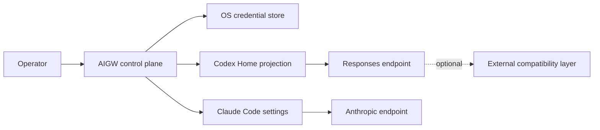
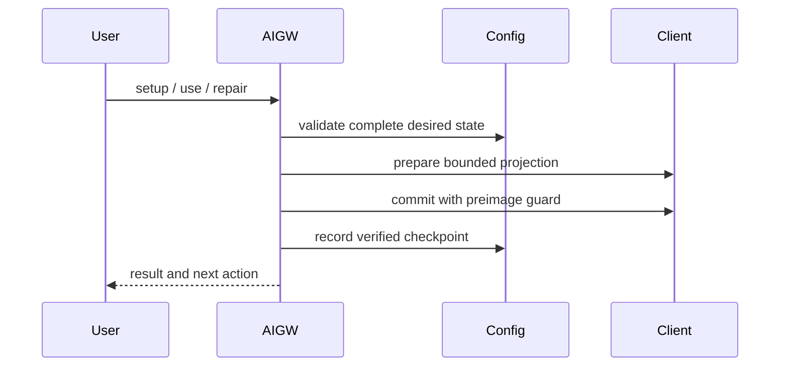

# Authority and Projection Boundary

AIGW is a local control plane. It turns reviewed configuration into bounded
native-client projections; it is not a model traffic gateway.

## Product position

AIGW minimizes the distance between an operator's intent and each client's
official configuration surface. It deliberately avoids becoming a mandatory
traffic hop, a client launcher, or an agent-state manager.

| Concern | AIGW role | Other owner |
| --- | --- | --- |
| Provider service and endpoint capability | Record verified Account capabilities | Provider |
| Token material | Store and retrieve an Account reference | OS credential store |
| Client intent | Select a Profile through a Route | AIGW configuration |
| Native client configuration | Project one admitted, bounded region | Client Adapter |
| Wire compatibility | Select an explicit endpoint | Endpoint product |
| Conversations, memory, tools, and GUI state | None | Client |

This split is the product's advantage over an all-in-one gateway: normal client
configuration remains direct, auditable, and usable when AIGW is not running.

## Product graph



## Authority

| Owner | Authoritative state |
| --- | --- |
| AIGW configuration | Accounts, Profiles, Routes, Adapter declarations |
| OS credential store | Account Tokens and optional diagnostic credentials |
| Codex | Conversations, JSONL, SQLite, model metadata, Desktop GUI state |
| Claude Code | Session and client runtime behavior |
| External endpoint product | Traffic normalization, retries, service lifecycle |
| GitLab / GitHub | Independent CI, tags, releases, and assets |

AIGW never edits conversation state and never manages an external endpoint
process.

## Semantic packages

| Package | Responsibility |
| --- | --- |
| `internal/configuration` | Account, Profile, Route, Adapter schema and persistence |
| `internal/secrets` | Token storage backends |
| `internal/codex` | Codex projection planning and reconciliation |
| `internal/claude` | Claude Code settings projection, credential-safe process plans, and readiness |
| `internal/credential` | Provider-neutral endpoint authentication validation |
| `internal/providers` | Optional provider-native diagnostics only |
| `internal/presentation` | Human projection of command results |
| `internal/cli` | Command composition; domain behavior remains in semantic owners |
| `internal/transaction` | Guarded filesystem mutation and rollback |
| `internal/upgrade` | Independent-Forge update verification and installation |

Dependency direction is toward domain owners. Presentation, CLI composition,
Forge code, and host discovery do not define product semantics.

## Configuration flow



Every multi-file change captures exact pre-state. Compensation runs in reverse
order only while the current bytes still match this transaction's postimage.
A newer writer is never overwritten.

## Client boundaries

### Codex

Codex CLI and Desktop share one Codex Home. AIGW owns only its marked provider
and model projection, sidecar, and native credential binding. Dry-run exposes
the plan without reading credentials or changing files.

### Claude Code

AIGW projects the selected endpoint and model into Claude Code's official
per-user `settings.json`. `apiKeyHelper` retrieves the active Account Token from
the AIGW credential store when Claude Code requests it; the Token is never
written to settings, shell profiles, arguments, or logs. Users continue to run
the native `claude` command directly.

### Missing clients

Setup and repair touch only admitted clients whose required executable and
surface are present. Missing and foreign clients remain untouched.

## Extension model

AIGW keeps three change axes independent. A feature must enter through exactly
the axis whose authority it changes.

| Axis | Normal change | Code required when |
| --- | --- | --- |
| Provider Account | Endpoint, protocol capability, models, Token reference, and verification evidence | Authentication or discovery cannot use an admitted Account contract |
| Client Adapter | Official configuration surface and its projection transaction | A new client is admitted |
| Protocol dialect | Explicit endpoint selection | A proven wire incompatibility requires a separate data-plane product |

An ordinary Bearer-authenticated OpenAI Responses or Anthropic endpoint is an
Account admission, not a new provider class. An authentication system such as
request signing, or a non-native invocation protocol, requires a separately
reviewed authentication or protocol Adapter; it must not be disguised as a
Bearer Account.

A Client Adapter is admitted only when it can perform this complete slice:

```text
discover -> plan -> guard preimage -> project atomically -> verify -> rollback
```

It must also define its uninstall boundary. OpenCode, Pi, Hermes Agent, Qoder,
and later clients therefore extend AIGW through the same contract rather than
through Codex or Claude Code conditionals. Hermes provider projection, for
example, would never grant AIGW authority over Hermes tools, memory, sessions,
or runtime lifecycle.

The detailed admission evidence belongs to
[Adapter Admission](../governance/adapter-admission.md). Provider-specific wire
recovery remains outside AIGW.

## External endpoints

An Account endpoint may be direct HTTPS or an explicit loopback URL. The
endpoint value is operator input. AIGW does not infer provider behavior from an
Account name, manage the listener, or duplicate its retry and concurrency
policy.
