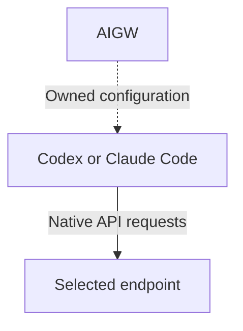

# Authority and Projection Boundary

AIGW is a local control plane. It turns reviewed configuration into bounded
native-client projections; it is not a model traffic gateway.

## Product position

AIGW minimizes the distance between an operator's intent and each client's
official configuration surface. It deliberately avoids becoming a mandatory
traffic hop, a client launcher, or an agent-state manager.

- **Provider service and endpoint capability**
  - **AIGW role:** Declare Account protocol endpoints
  - **Other owner:** Provider
- **Token material**
  - **AIGW role:** Select and use one Account Token backend
  - **Other owner:** Native credential service or AIGW owner-only store
- **Client intent**
  - **AIGW role:** Select a Profile through a Route
  - **Other owner:** AIGW configuration
- **Native client configuration**
  - **AIGW role:** Project one admitted, bounded region
  - **Other owner:** Client Adapter
- **Wire compatibility**
  - **AIGW role:** Select an explicit endpoint
  - **Other owner:** Endpoint product
- **Conversations, memory, tools, and GUI state**
  - **AIGW role:** None
  - **Other owner:** Client

Native clients send requests directly. AIGW runs for explicit configuration
operations or on-demand credential helpers; no AIGW daemon is required.
Traffic gateways remain independently selected endpoints. Comparative claims
belong to the [provider tooling assessment](../research/provider-tooling-assessment.md),
not this design contract.

## Product graph

The request sender is the native client, not its configuration file. An external
gateway, when selected, occupies an endpoint node; it is not an extra mandatory
hop. AIGW does not own that endpoint's process.

## Authority

| Owner                     | Authoritative state                                              |
| ------------------------- | ---------------------------------------------------------------- |
| AIGW configuration        | Accounts, Profiles, recommendations, selected Routes, Adapters   |
| Selected Token store      | Account Tokens; the selection policy belongs to AIGW             |
| Codex                     | Conversations, JSONL, SQLite, model metadata, Desktop GUI state  |
| Claude Code               | Session and client runtime behavior                              |
| External endpoint product | Traffic normalization, retries, service lifecycle                |
| Local Git                 | Signed commit and annotated-tag objects                          |
| GitLab / GitHub           | Independent hosting, CI observations, Release records and assets |

AIGW never edits conversation state and never manages an external endpoint
process.

## Semantic packages

- **`internal/configuration`:** Account, Profile, Route, Adapter schema and persistence
- **`internal/secrets`:** Account credential backends, typed diagnostic credentials and replacement
- **`internal/providers/diagnostic`:** Optional provider-account diagnostic result contract
- **`internal/codex`:** Codex projection planning and reconciliation
- **`internal/claude`:** Claude Code settings projection, credential-safe process plans, and readiness
- **`internal/credential`:** Provider-neutral endpoint authentication validation
- **`internal/providers`:** Optional provider-native diagnostics only
- **`internal/presentation`:** Human and JSON rendering of command results
- **`internal/cli`:** Command composition; domain behavior remains in semantic owners
- **`internal/transaction`:** Guarded filesystem mutation and rollback
- **`internal/upgrade`:** Independent-Forge update verification and installation

Dependency direction is toward domain owners. Presentation, CLI composition,
Forge code, and host discovery do not define product semantics.

### Module depth

Prefer a small, stable interface that hides a complete responsibility. A module
earns its boundary by reducing what its callers must know, coordinate, and
recover from; moving code into another file or forwarding the same arguments
does not establish an abstraction.

Review boundaries by asking:

- Can the implementation change without coordinated edits in its callers?
- Does the interface expose intent, rather than internal steps or state?
- Does one owner handle each invariant and its failure recovery?
- Does a proposed split remove knowledge from callers? If not, keep the
  responsibility together or remove the forwarding layer.

Depth is not size. Preserve cohesive responsibilities even when they need more
code, while splitting independent responsibilities that merely happen to live
together. Review line counts as signals, not reasons to create shallow modules.

## Configuration admission

Configuration admission checks every Profile against its Account's declared
protocol endpoints, including Profiles not selected by a Route. It uses the
same client-protocol definition as runtime resolution. Manifest import and local
persistence share that validation; neither may accept a Profile that cannot
resolve its protocol endpoint. This is a structural check, not evidence of
credentials, installed clients, endpoint availability, or successful inference.

Imported recommendations and actual selections have separate meanings in that
same configuration. Import retains the recommendation; setup and sync select
only for clients without a Route. They prefer an available recommendation, then
its model on another usable Account, then stable Profile identifier order.
Unavailable credentials do not authorize replacing an existing selection.

Configuration cloning owns independence of nested Account diagnostics and
Adapter target slices as well as maps. Read-only runtime resolution observes
the selected Profile and Account directly; it neither clones the whole
configuration nor initializes its collections. Behavioral tests cover those
contracts instead of enumerating names of removed APIs.

## Synchronization and setup

Setup creates the first Profiles; it is not configuration replacement or Token
rotation for an existing installation. Synchronization owns that admission
rule. All setup command forms check it before prompting or probing, and the
transaction checks it again before discovery or credential writes. An existing
credential slot alone does not make the installation configured: first-time
setup may use or replace that slot with guarded compensation.

The mutation lock has two distinct states: a persistent lock file and an
active operating-system lock. Unlocking releases the latter; the shared file
remains to keep concurrent processes using the same lock identity. Acceptance
requires immediate reacquisition after failure and no temporary payload,
backup, checkpoint or projection residue. File existence alone is not evidence
of a held lock.

Synchronization owns preparation, guarded application, and
compensation across client projections. Its callers express desired
configuration and handle the outcome; they should not reproduce the ordering
of sidecar writes or recovery steps. Each client Adapter hides its native file
format and ownership rules. Sharing transaction mechanics does not justify
combining the clients' distinct semantics.

Configuration repair discovers admitted clients and reconciles AIGW-owned
projections. It reports configuration changes, not authentication success.
Rename planning describes changes to Account references and projections; it
cannot certify Provider authentication or client execution.

`Synchronizer.Setup` owns initial configuration, optional Token updates and
client activation as one transaction. CLI onboarding collects operator input
and renders the result; it does not coordinate credential rollback. Setup
validates configuration, Account ownership and client scope before touching
credentials. It admits writes only while the request is active. The shared
commit independently admits configuration persistence for selection,
projection and repair. Cancellation after credential preparation returns
through the credential owner's compensation rather than accepting a partial
setup. These are admission checks, not an atomic cancellation guarantee during
synchronous filesystem or credential-backend calls.

Configuration persistence rechecks cancellation after snapshot capture and
projection preflight. The client registry admits each adapter separately;
cancellation between adapters restores earlier owned projections in reverse
order without starting the next one. That failure also compensates any
configuration already committed by the enclosing transaction. Recovery runs
independently of the cancelled context and retains both cancellation and
ownership conflicts. Cancellation after the last admitted adapter completes
does not retroactively fail the completed transaction.

`Synchronizer.SelectProfile` owns daily selection, optional validated Token
storage and the selected client's projection. CLI selection collects and
validates input, then renders the committed result without a rollback handle.
The Profile's client scope reaches discovery, preflight and projection writes;
drift in another client's files neither blocks nor changes this selection.
Repeated selection reconciles only that client without rewriting unchanged
configuration or checkpoints. Rendering failure does not undo a committed
selection or its credentials.

## Verification checkpoints

Live verification does not hold a configuration lock while waiting for a
client. The configuration Store owns the short checkpoint commit: it acquires
the same bounded lock as mutations, checks that the verified configuration is
still current, and writes through the guarded filesystem boundary. Changed
configuration invalidates that result rather than replacing a newer
checkpoint. A detected external write during commit triggers compensation of
only the checkpoint written by that operation. This is not a filesystem-wide
transaction against editors that ignore the lock, nor a promise of continuing
Provider availability after the request.

## Credential storage

The secrets module accepts Account-to-Token updates and owns both credential
compensation and any automatic backend selection created by those writes.
Setup and rotation never coordinate those internal recovery steps. Compensation
preserves newer credentials and retains the backend while a credential cannot
be restored. Client-owned authentication is neither copied nor restored.

Within that package, the storage contract, backend selection, credential kinds,
and batch replacement are separate responsibilities. Backend selection owns
its observation, persistence, and compensation together. A credential-kind view
narrows slot access without hiding that backend from observation or recovery.
These private responsibilities share one package; callers do not coordinate
filesystem snapshots or recovery steps.

One credential-kind view owns Account and value validation before any backend
resolution, including presence checks. All store constructors return that view;
private backends implement only purpose-aware storage, not a second default
API-Token interface. Selecting the same kind is idempotent. Selecting another
kind changes only the slot namespace; backend identity, inspection, read-only
behavior and compensation remain unchanged. Purpose selection is not caller
authorization.

`NewDiagnosticCredentialStore` binds the selected backend's diagnostic slots
to the single `DiagnosticCredential` schema. It performs no diagnostics and
does not select a backend. Memory, file, environment and native backends share
that adapter; tests do not use a parallel diagnostic storage implementation.
Credential identifiers refer to Accounts, never Profiles. `Exists` observes
slot presence without reading or validating its contents; `Get` reads and
requires both credential fields, distinguishing absence from invalid stored
data. Neither observation proves that the Provider accepts those credentials.
Provider diagnostic reports remain separate from credential storage.

An invocation may cache the selected backend, but inspection reads the current
selection metadata rather than caching whether it was persisted. A matching
external choice is reported as persisted; absence is deferred; a conflicting or
invalid choice makes observation fail without switching backends or reading
credential values. Each ordinary write or
deletion revalidates its persisted choice first. A conflicting or invalid choice
stops the mutation; a missing choice is persisted first. Compensation instead
targets the original backend and credential kind: it restores only its unchanged
postimage, then separately attempts to restore its backend choice. This does not
make selection and a native credential service one cross-process transaction.

Credential rotation validates and replaces only the selected Account Token.
It does not invoke clients or change configuration. Both admitted clients read
Account Tokens through a command helper; same-Account rotation becomes visible
on its next invocation, subject to the client's refresh policy. Client-native
authentication is outside AIGW's credential ownership.

Credential validation, endpoint tests and readiness diagnostics share the
credential owner's authenticated request boundary. Native HTTP clients are
copied with redirect following disabled, keeping credentials at the selected
endpoint without changing the caller's client. Validation and endpoint tests
also share response draining, closure and the bounded request lifetime;
diagnostics retain their own bounded response interpretation. A redirect is
not successful authentication. An unavailable Claude model-discovery endpoint
may demonstrate reachability, but leaves credential acceptance unverified.

Optional provider-account diagnostics use that same authenticated request
boundary for both balance and Token queries. Their provider-specific reader
requires one complete JSON document within its response budget; read, close,
size and syntax failures invalidate the observation. Reaching the pagination
budget reports an incomplete search, not proof that the Token is absent.

## Identity migration

Identity migration follows the same boundary: `internal/renaming.Service` owns
Profile renaming, Account credential preparation and commit, and verified
finalization. CLI commands only resolve operator intent and render the result.
The service has no command, prompt, or presentation dependency. Cancellation
observed before credential preparation or finalization admission starts no
writes; once an admitted credential copy has occurred, a failed configuration
commit preserves both slots for retry and rollback.

Configuration owns the recovery boundary and the stable enabled-client set.
Its Store captures the ordinary configuration/backup/checkpoint snapshot. When
clients are enabled, it compares current and checkpoint configurations by their
canonical persisted representation. Comments and presentation-only IDs do not
change that identity; changed configuration does. Renaming requires the
checkpoint to cover every enabled client before credential retirement, not every
client supported by the product. With no enabled clients, no checkpoint is
required and no client verification is claimed. An existing checkpoint must
still match current configuration so rollback cannot revive retired credential
references. Backup convergence checks the captured preimages
and writes owner-only permissions through the existing guarded atomic writer;
it returns success or failure, not an unused postimage receipt.

Checkpoint reading consumes exactly one complete JSON document. Writer and
reader share one nonempty, unique, admitted-client scope rule; invalid scope
fails before persistence. A valid subset records only the clients actually
verified. Enabled-client coverage remains a separate finalization requirement,
not something the checkpoint reader infers from a nonempty list.

## Upgrade and process execution

The upgrade module owns portable artifact admission. Installation and
same-version comparison share checksum and target-layout verification. An
explicit local candidate is a no-op only when its verified program bytes equal
the current executable; a version label alone proves neither artifact identity
nor successful verification. This comparison leaves the current and retained
programs untouched and does not execute the candidate.

Release-source selection resolves embedded defaults and explicit environment
overrides once per update. Metadata lookup and asset retrieval consume that
same source snapshot, including the GitLab CLI and authenticated HTTP fallback.
Provider-neutral selection and dispatch belong to the source owner, not either
Forge transport; a transport cannot silently reselect its host or repository.

Upgrade helper invocations use the shared process plan: executable, arguments,
environment, and input remain one explicit value. Captured metadata and streamed
artifact output differ only in their output contract. Both use the same platform
launcher, Windows Job ownership, bounded diagnostic capture, and pipe-drain
deadline. File capture streams artifact bytes directly; a failed command, an
incomplete diagnostic stream, or an unclosed pipe rejects and removes the partial
asset. Upgrade owns Forge error interpretation, not a second executor or output
limiter. GitLab binds its selected host for both paths; executor capability does
not change peer selection or silently discard the host environment.
GitLab also binds API host, scheme and root path, so ambient CLI aliases and
stored API routing cannot redirect the selected release source. GitHub's CLI
fallback binds the admitted source host instead of inheriting `GH_HOST`.
Overrides use `os/exec`'s last-value precedence, not a separate environment
merger. Native GitLab conformance uses the locked CLI, isolated configuration,
synthetic credentials and two loopback servers to prove both capture and file
download reach only the selected origin.
An explicit empty environment remains empty; inheritance is represented by an
unspecified environment. Process plans represent captured child invocations,
not replacement of AIGW. There is no uncaptured launcher or replacement mode.

Verification, client adapters, synchronization and CLI invocation share the
existing `process.CaptureRunner` contract. They require only the operation they
use; capability mismatches fail during compilation rather than through a
late type assertion. An absent runner still produces a bounded unavailable
diagnostic. In-memory and file capture remain distinct contracts because they
have different output ownership and memory limits.

## Repository tooling

Repository-only executables follow the same ontology: `tools/ci`,
`tools/coverage`, `tools/forge`, `tools/release`, and `tools/repository` own
cross-cutting repository concerns, while client-specific verification is nested
under its client owner. `tools/codex/catalog` owns catalogue acceptance,
measurements and reporting. It consumes the same `internal/codex/catalog`
document transformation as product projection, not a second parser or alias
builder. That document owner preserves all client metadata and adds only
uniquely established aliases. `internal/codex` owns isolated client reads,
executable identity, projection state and transactional file ownership; it does
not carry repository acceptance verdicts.

Native product journeys belong to `tools/release`: they exercise built artifacts,
credential backends, client projections, upgrades, rollback and uninstall. CI
schedules those tests but does not own their fixtures. `tools/release/readiness`
reads and validates the canonical `VERSION` once for CI admission, release
construction and native journeys; malformed SemVer fails before execution.
Package-local test file readers do not expose a shared test-support API.

CI projection consumes branch roles from `.ethos/workspace.toml` through CUE's
native TOML input. It does not copy role values or interpret ETHOS internals.
The generic accepted-tree/OpenSpec check still in `tools/repository` is an
unresolved governance overlap, not an AIGW product responsibility. Replace it
only when an equivalent detached-checkout admission is demonstrably available;
deleting the only current check would weaken publication safety.

Forge command parsing belongs to `tools/forge/main.go`; Git-object provenance
belongs to `provenance.go`, and peer transport belongs to `project.go`.
Publication calls the same typed commit verifier as the read-only command,
not a reconstructed command line. Policy and identity metadata come from the
resolved source commit, never an unrelated checkout or an uncommitted file.
Peer selection cannot change that object or its verification authority.

Release construction, readiness, publication and upgrade consume the existing
SemVer library's strict parser, not separate version grammars. Publication
validates its tag once and carries the parsed identity into asset selection and
stability classification. Prerelease status comes from the prerelease field,
never punctuation or channel-like text in build metadata. Native signing
admission remains a separate readiness responsibility; a valid version alone
does not establish release readiness. CUE runs tag-source verification and
requires that same admission before each peer verifies its published artifacts.
The operator constructs and signs one matrix; each peer independently receives
and verifies those bytes using public trust, without hosted signing keys. Document formatting,
structure and links have their native quality gates; prose is not release
evidence.

Native acceptance consumes the upgrade archive contract rather than parsing a
GoReleaser binary inventory or duplicating extraction. The declared dependency
is one-way: release construction calls `internal/upgrade/artifact.Target` to
verify and extract the same bytes that product updates consume. Runtime code
does not import repository tools. Both built and published inputs use that
reader; acceptance owns scratch, never the input artifact directory.

Construction owns validation of embedded release sources. The standalone
source check and build admission use the same request-owned validator before
running tools. Each Forge is optional; a selected source requires its HTTPS
origin and complete repository path together. GitLab permits nested namespaces,
while GitHub requires an owner/repository pair. Runtime endpoint overrides
remain the upgrade owner's responsibility, not a dependency of construction.

An origin contains only a scheme and nonempty hostname with an optional port
and root slash. Native URL reconstruction rejects credentials, paths and even
empty query or fragment markers. Repository coordinates are unescaped relative
paths with a namespace; native path validation and URL escaping must preserve
the input exactly. Encoded separators cannot change its routing meaning.
Both boundaries use the standard library rather than separate segment scanners;
runtime-only private HTTP admission does not weaken HTTPS build metadata.

## Configuration transaction

The shared commit path owns this sequence:

1. Capture configuration, backup and checkpoint preimages.
2. Preflight every participating client before writing. A rejected preflight
   returns an error without changing configuration or client files.
3. Persist configuration and invalidate stale verification.
4. Apply client projections. On failure, compensate applied projections, then
   restore unchanged owned configuration files; return the original error and
   every recovery conflict. Otherwise, return success.

A later successful verification owns the checkpoint. Setup adds credential
preparation and compensation around this transaction.

Each write is guarded by its preimage. Compensation restores a preimage only
while the current bytes match this operation's postimage; newer writes remain
untouched. One conflict does not suppress restoration of independent owned
files. Original errors remain identifiable through the returned aggregate.
Recovery checkpoints describe their captured configuration, not a new claim
that an externally changed configuration was verified. This is not a
filesystem-wide transaction against external editors.

## Client boundaries

Account-Token routes use a helper whose fingerprint binds the client, Account
and endpoint. Before reading a Token, it compares that fingerprint with the
selected Route. A mismatch requires synchronization and client reload without
credential access. Model and label changes preserve the fingerprint; it detects
stale projections, not caller authorization. Client-native Codex authentication
uses no AIGW Token helper.

### Codex

Codex CLI and Desktop discover the same default Codex Home; additional homes
are explicit Adapter targets. AIGW owns the recorded provider tables, root
selections, configured scheduler fields, derived catalogue and sidecar, including
its credential-helper configuration. Decorative markers are not the ownership
boundary. Dry-run exposes
the plan without reading credentials or changing files. A Codex-scoped Profile
may select one explicit native provider identity. AIGW then projects that exact
table with the Account endpoint and an absolute command-authentication helper;
the Account still owns the Token and Codex still owns conversation state.
Client-native authentication projects no AIGW credential helper. The Provider
name and model catalogue are independent of credential ownership.

Codex provider ownership binds the recorded canonical values, not the text span
between decorative comments. The native TOML parser locates the provider and
authentication tables even when the client inserts an MCP table between them or
moves the closing comment. Inspection compares the same rendering used for
projection; withdrawal removes only the proven provider ranges. Unknown or
changed provider fields remain conflicts, and surrounding user tables retain
their original source bytes. Root selections and scheduler state retain their
separate ownership checks. The strict model includes admitted predecessor
authentication fields even when current projections no longer emit them.

Root selections are located through the locked TOML parser, not a document-wide
regular expression. Named profiles, dotted keys, arrays of tables, and text inside
strings are outside that selection boundary. AIGW edits only the located source
range, preserving unrelated text and restoring recorded original assignments on
withdrawal. Quoted keys and multiline original values retain their meaning;
model identifiers and catalogue paths are literal values, not replacement syntax.
Malformed or ambiguous input fails before the transaction writes files.

Scheduler tables also use native TOML boundaries. Example headers inside user
instructions are data, never table declarations. Integer capture, projection and
verification accept the same TOML spellings. Withdrawal restores recorded
scheduler values without a document-wide comment rewrite; unrelated text remains
unchanged. Scheduler value restoration does not promise original whitespace or
numeric spelling.

### Claude Code

AIGW projects the selected endpoint and model into Claude Code's official
per-user `settings.json`. `apiKeyHelper` retrieves the projection-matching Account
Token from the selected AIGW Token store when Claude Code requests it; the Token is never
written to settings, shell profiles, arguments, or logs. Users continue to run
the native `claude` command directly.

The Claude settings module owns synchronization validation. Adapter inspection
and native verification share that read-only decision. Equivalent JSON escapes
or whitespace preserve readiness, and synchronization leaves the settings and
sidecar bytes unchanged. A missing projection or proven model-only change can
be synchronized; an endpoint or credential-helper conflict must be resolved
without overwriting user edits. Malformed input must be corrected before
projection. Inspection neither repairs files nor reads Token values.

### Missing clients

Setup and repair touch only admitted clients whose required executable and
surface are present. Missing and foreign clients remain untouched.

## Extension model

Classify an extension by the contract it changes. An integration may span
several contracts; each concern belongs to its existing owner rather than a
provider-named implementation of all of them.

- **Compatible endpoint or model**
  - **Extension path:** Account data
  - **AIGW implementation consequence:** Configuration only
- **Distinct credential exchange**
  - **Extension path:** Existing client-native authentication when supported
  - **AIGW implementation consequence:** Declare the Profile's authentication owner; extend a credential boundary only when the admitted client cannot supply it
- **New local configuration target**
  - **Extension path:** Client Adapter
  - **AIGW implementation consequence:** Add one complete client transaction
- **Incompatible request or response behavior**
  - **Extension path:** Independent data plane
  - **AIGW implementation consequence:** Select its endpoint; do not add transport to AIGW

Account admission owns protocol endpoints and credential references. Profiles
own the Account, client and model choice; Routes own selection. Catalogue
observations, authenticated probes and client verification provide separate
evidence rather than becoming configuration facts. Code is needed only when
authentication or discovery exceeds the admitted Account contract. Client
Adapters own native configuration transactions; independent protocol products
own proven wire incompatibilities.

An ordinary OpenAI Responses endpoint using Bearer authentication, or an
Anthropic endpoint using an API-key header, is Account data rather than a new
provider class. A Codex Profile may instead declare `authentication =
"client-native"` with an explicit `model_provider` when that client already
owns the required credential chain and signing. AIGW projects the selection
without reading client credentials or adding a signer. The selected client,
endpoint and model still require real invocation evidence.

An unsupported credential exchange needs a separately reviewed authentication
extension; an incompatible wire protocol belongs to an independently selected
data plane. Neither case is admitted by treating its credentials as an ordinary
Account Token or branching on a provider name.

A Client Adapter must own discovery, planning, guarded projection and
compensation, local inspection, explicit client verification and withdrawal.
Projection failure compensates only unchanged owned writes; a later failed
Provider request does not implicitly undo the operator's configuration.

The [projection transaction](../decisions/dr-0006-transactional-client-projection.md)
prepares every target before writing and guards compensation against newer
edits. It does not provide atomic visibility across client files or homes.

It must also define its uninstall boundary. OpenCode, Pi, Hermes Agent, Qoder,
and later clients therefore extend AIGW through the same contract rather than
through Codex or Claude Code conditionals. Hermes provider projection, for
example, would never grant AIGW authority over Hermes tools, memory, sessions,
or runtime lifecycle.

The detailed admission evidence belongs to
[Adapter Admission](../governance/adapter-admission.md). Provider-specific wire
recovery remains outside AIGW.

## External endpoints

An Account endpoint may be direct HTTPS or an explicit loopback URL. The
endpoint value is operator input. AIGW does not infer provider behavior from an
Account name, manage the listener, or duplicate its retry and concurrency
policy. Every external gateway therefore has the same AIGW relationship: it may
be selected explicitly, is neither installed nor required by AIGW, and may be
removed without changing AIGW's configuration model.
