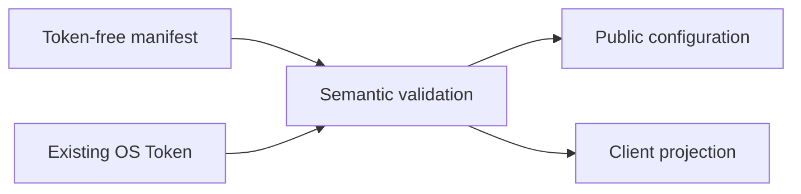

# Security Model

AIGW keeps credentials local, mutations bounded, and client ownership explicit.

## Secret boundary

| Secret | Store | Repository/config exposure |
| --- | --- | --- |
| Account Token | `AIGW_TOKEN/<account>` in the OS credential store | Never |
| Optional diagnostic credential | `AIGW_ACCOUNT/<account>` | Never |
| Forge publication credential | Protected CI or operator process | Never tracked |

Linux without a usable Secret Service fails explicitly. CI may select the
read-only environment backend; it validates pre-provisioned values but cannot
persist or rotate them.

## Configuration boundary

A manifest collision must be semantically identical or explicitly replaced.
Replacing Account metadata never redirects or overwrites the existing Token.

## Client boundary

| Client | AIGW may write | AIGW never writes |
| --- | --- | --- |
| Codex | Marked provider/model block, sidecar, official credential binding | Conversation JSONL, SQLite, history, item records, model metadata, Desktop GUI state |
| Claude Code | AIGW-owned endpoint/model keys, sidecar, and credential helper | Plaintext Token, shell profiles, command interception, sessions, or unrelated settings |
| Missing/foreign client | Nothing | Directories, launch state, configuration |

## Transaction boundary

Every multi-file mutation:

1. validates the complete desired state;
2. captures exact preimages;
3. prepares all writes before the first commit;
4. checks the expected preimage before each write;
5. compensates in reverse order only while postimages still match.

This prevents rollback from overwriting a newer writer.

## Network boundary

- Endpoint verification is bounded and explicit.
- Redirects never forward credentials across origins.
- HTTPS-to-HTTP redirect is rejected.
- Tokens are not placed on command lines or persisted in logs.
- A loopback endpoint is not proof of listener health or ownership.
- `aigw verify` may consume quota only when the operator requests it.

## Output boundary

Human, JSON, logs, and diagnostics exclude:

- Token values;
- raw response bodies;
- configuration bodies where not required;
- private filesystem paths;
- inherited client-token environment values.

Errors name the problem, bounded evidence, impact, and one recommended action.

## Update boundary

Each Forge supplies a complete provider-native tag, checksum manifest, and
artifact. AIGW never combines these elements across providers. Authentication,
metadata, checksum, archive-layout, downgrade, and redirect failures are
terminal.

## Uninstall

Uninstall removes only AIGW-owned configuration markers, Claude settings state,
credentials, and program files for the selected installation channel. It does
not remove client conversations, provider accounts, or another product.
