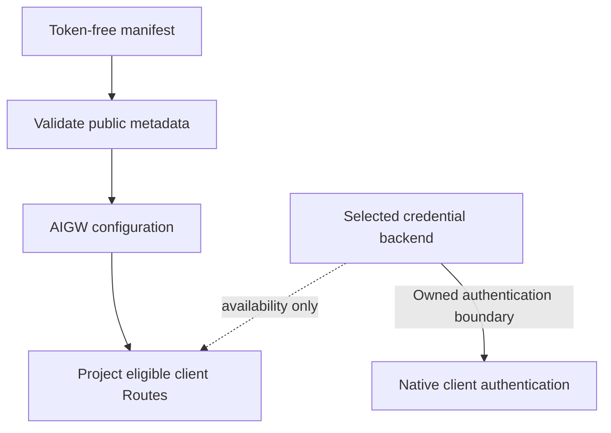

# Security Model

AIGW keeps credentials local, mutations bounded, and client ownership explicit.

## Credential storage

| Secret                         | Store                                                                                  | Repository/config exposure |
| ------------------------------ | -------------------------------------------------------------------------------------- | -------------------------- |
| Account Token                  | One selected local backend: native credential service or platform-protected AIGW files | Never                      |
| Optional diagnostic credential | The selected AIGW credential backend, under `diagnostic@<account>`                     | Never                      |
| Forge publication credential   | Protected CI or operator process                                                       | Never tracked              |

Automatic selection first honors an existing backend choice. Without one, it
attempts native-service metadata access and selects that backend if the probe
succeeds; otherwise it selects one AIGW-owned fallback store. The probe does
not read Tokens or prove future read/write permission. macOS and Linux enforce an
owner-only directory and regular file per Account. Windows encrypts each Token
with current-user DPAPI before writing it beneath the AIGW data directory.
Both implementations use bounded paths and same-directory replacement. AIGW
never searches or writes both stores. Explicit `keyring` selection fails closed
when the service is unavailable. Controlled automation may select the read-only
environment backend; it reads
`AIGW_TOKEN_<ACCOUNT>` values supplied to that process but cannot persist,
rotate, or delete them. The optional provider-diagnostic pair uses
`AIGW_DIAGNOSTIC_SYSTEM_TOKEN_<ACCOUNT>` and
`AIGW_DIAGNOSTIC_USER_ID_<ACCOUNT>` under the same reversible Account-ID
encoding; both values are required, and neither can substitute for the API
Token.

Read-only commands do not persist a new choice. The first credential mutation
records its selected backend before changing Token state; a failed mutation
compensates only the choice it created. Once persisted, an unavailable backend
fails closed rather than silently choosing another store. To require a specific
mechanism, set `AIGW_SECRET_BACKEND` to
`keyring`, `file`, or `env` before running AIGW:

| Backend   | macOS                          | Linux                          | Windows                           | Mutation |
| --------- | ------------------------------ | ------------------------------ | --------------------------------- | -------- |
| `keyring` | Keychain                       | Secret Service                 | Credential Manager                | Yes      |
| `file`    | Owner-only AIGW file           | Owner-only AIGW file           | Current-user DPAPI-protected file | Yes      |
| `env`     | Process `AIGW_TOKEN_<ACCOUNT>` | Process `AIGW_TOKEN_<ACCOUNT>` | Process `AIGW_TOKEN_<ACCOUNT>`    | No       |

Selecting `keyring` never opens an interactive fallback or silently switches
stores. If the native service is unavailable, the command fails with a bounded
recovery action. The `env` backend is intentionally read-only for credentials:
setup, checks and client helpers may consume existing values, and setup may
persist public configuration. Attempts to store, rotate or delete an environment
Token fail before credential mutation.

Supply environment credentials to the process that needs them. A Token set in
one terminal is not automatically inherited by a separately launched GUI client.
The projected helper runs in the client's environment. See the
[environment-variable reference](../../README.md#environment-variables) for
Account-ID encoding and process scope.

## Configuration boundary

A manifest collision must be semantically identical or explicitly replaced.
Replacing Account metadata never redirects or overwrites the existing Token.

## Client boundary

| Client                 | AIGW may write                                                        | AIGW never writes                                                                                        |
| ---------------------- | --------------------------------------------------------------------- | -------------------------------------------------------------------------------------------------------- |
| Codex                  | Marked provider/model block, sidecar, credential-helper configuration | Native credentials, conversation JSONL, SQLite, history, item records, model metadata, Desktop GUI state |
| Claude Code            | AIGW-owned endpoint/model keys, sidecar, and credential helper        | Plaintext Token, shell profiles, command interception, sessions, or unrelated settings                   |
| Missing/foreign client | Nothing                                                               | Directories, launch state, configuration                                                                 |

## Transaction boundary

Every multi-file mutation:

1. validates the complete desired state;
2. captures exact preimages;
3. prepares all writes before the first commit;
4. checks the expected preimage before each write;
5. compensates only unchanged owned postimages, continuing independent recovery
   after a conflict and preserving all failure causes.

These checks preserve detected newer writes. They are best-effort filesystem
guards, not cross-process CAS against editors that ignore AIGW's mutation lock.
The [transaction model](authority-and-projection-boundary.md#configuration-transaction)
owns sequencing and compensation details.

## Network boundary

- Endpoint verification is bounded and explicit.
- Redirects never forward credentials across origins.
- HTTPS-to-HTTP redirect is rejected.
- Tokens are not placed on command lines or persisted in logs.
- A loopback endpoint is not proof of listener health or ownership.
- `aigw verify` may consume quota only when the operator requests it.

An initial 401 is transient only when three bounded observations recover, and a
Token is classified as persistently invalid only after three further 401
responses. Mixed results or cancellation remain retryable instability. This
single-command observation covers one configured endpoint and in-memory Token;
it does not prove direct-upstream health, account or billing state, or a later
request.

## Output boundary

User-facing output excludes Token values and inherited client-token environment
values. The credential-helper protocol deliberately writes only its requested
Token to the invoking client's stdout; it is not a diagnostic or export surface.
Diagnostics expose bounded, redacted response details rather than unbounded
raw bodies. Explicit inspection and export commands may show configuration
paths, endpoints or public configuration; those are not secret-free telemetry
for public redistribution. Review such output before sharing it.

Errors name the problem, bounded evidence, impact, and one recommended action.

## Update boundary

Local Git supplies the single signed product tag. Each selected Forge receives
that exact tag object and independently supplies its Release record and assets.
AIGW never combines a tag, checksum manifest, or artifact across peers.
Authentication, object identity, metadata, checksum, archive-layout, downgrade,
and redirect failures are terminal.

## Uninstall

Uninstall first withdraws AIGW-owned client projections, including marked
configuration blocks, sidecars, generated catalogues, and credential helpers.
It then removes the selected program and its rollback copy. Accounts, Profiles,
Routes, Tokens, explicit configuration backup, client conversations, and
neighboring user-authored settings remain intact.
