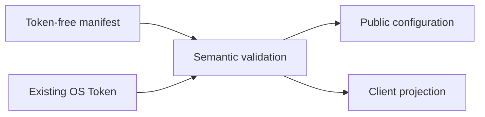

# Security Model

AIGW keeps credentials local, mutations bounded, and client ownership explicit.

## Secret boundary

| Secret                         | Store                                                                                  | Repository/config exposure |
| ------------------------------ | -------------------------------------------------------------------------------------- | -------------------------- |
| Account Token                  | One selected local backend: native credential service or platform-protected AIGW files | Never                      |
| Optional diagnostic credential | The selected AIGW credential backend, under `diagnostic@<account>`                     | Never                      |
| Forge publication credential   | Protected CI or operator process                                                       | Never tracked              |

On every supported platform, automatic selection proves whether the native
credential service is reachable. It pins that service when available;
otherwise it pins one AIGW-owned fallback store. macOS and Linux enforce an
owner-only directory and regular file per Account. Windows encrypts each Token
with current-user DPAPI before writing it beneath the AIGW data directory.
Both implementations use bounded paths and same-directory replacement. AIGW
never searches or writes both stores. Explicit `keyring` selection fails closed
when the service is unavailable. Controlled automation may select the read-only
environment backend; it reads
`AIGW_TOKEN_<ACCOUNT>` values supplied to that process but cannot persist,
rotate, or delete them. The optional provider-diagnostic pair uses
`AIGW_DIAGNOSTIC_SYSTEM_TOKEN_<ACCOUNT>` and
`AIGW_DIAGNOSTIC_USER_ID_<ACCOUNT>` under the same reversible Account-ID
encoding; both values are required, and neither can substitute for the API
Token.

## Configuration boundary

A manifest collision must be semantically identical or explicitly replaced.
Replacing Account metadata never redirects or overwrites the existing Token.

## Client boundary

| Client                 | AIGW may write                                                    | AIGW never writes                                                                      |
| ---------------------- | ----------------------------------------------------------------- | -------------------------------------------------------------------------------------- |
| Codex                  | Marked provider/model block, sidecar, official credential binding | Conversation JSONL, SQLite, history, item records, model metadata, Desktop GUI state   |
| Claude Code            | AIGW-owned endpoint/model keys, sidecar, and credential helper    | Plaintext Token, shell profiles, command interception, sessions, or unrelated settings |
| Missing/foreign client | Nothing                                                           | Directories, launch state, configuration                                               |

## Transaction boundary

Every multi-file mutation:

1. validates the complete desired state;
2. captures exact preimages;
3. prepares all writes before the first commit;
4. checks the expected preimage before each write;
5. compensates in reverse order only while postimages still match.

This prevents rollback from overwriting a newer writer.

## Network boundary

- Endpoint verification is bounded and explicit.
- Redirects never forward credentials across origins.
- HTTPS-to-HTTP redirect is rejected.
- Tokens are not placed on command lines or persisted in logs.
- A loopback endpoint is not proof of listener health or ownership.
- `aigw verify` may consume quota only when the operator requests it.

An initial 401 is transient only when three bounded observations recover, and a
Token is classified as persistently invalid only after three further 401
responses. Mixed results or cancellation remain retryable instability. This
single-command observation covers one configured endpoint and in-memory Token;
it does not prove direct-upstream health, account or billing state, or a later
request.

## Output boundary

Human, JSON, logs, and diagnostics exclude:

- Token values;
- raw response bodies;
- configuration bodies where not required;
- private filesystem paths;
- inherited client-token environment values.

Errors name the problem, bounded evidence, impact, and one recommended action.

## Update boundary

Local Git supplies the single signed product tag. Each selected Forge receives
that exact tag object and independently supplies its Release record and assets.
AIGW never combines a tag, checksum manifest, or artifact across peers.
Authentication, object identity, metadata, checksum, archive-layout, downgrade,
and redirect failures are terminal.

## Uninstall

Uninstall first withdraws AIGW-owned client projections, including marked
configuration blocks, sidecars, generated catalogues, and credential helpers.
It then removes the selected program and its rollback copy. Accounts, Profiles,
Routes, Tokens, explicit configuration backup, client conversations, and
neighboring user-authored settings remain intact.
