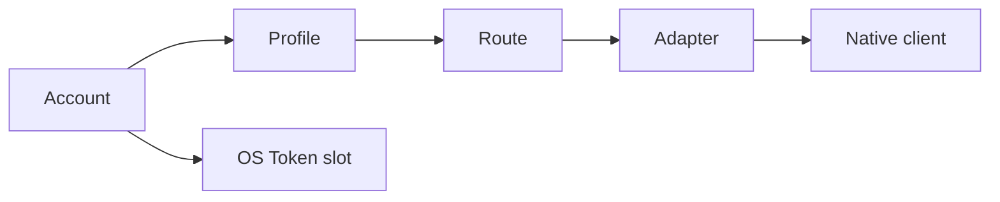

# Product Concepts

AIGW has four configuration entities and two external boundaries.



## Core entities

| Entity | Meaning | Cardinal rule |
| --- | --- | --- |
| Account | One provider endpoint and logical Token boundary | Token belongs to the Account, not a Profile |
| Profile | One `account + client + model` choice | Client scope is explicit |
| Route | Default or client-specific Profile selection | No hidden provider fallback |
| Adapter | Projection into one native client | Never writes another client's surface |

## Account

An Account contains:

- a human label;
- an OpenAI Responses endpoint, an Anthropic endpoint, or both;
- one logical Token stored by the operating system;
- an optional provider-native diagnostic declaration.

```toml
[accounts.team]
label = "Team Gateway"

[accounts.team.endpoints]
openai_responses = "https://gateway.example/v1"
anthropic = "https://gateway.example"
```

Configuration and manifests never contain the Token.

## Profile

A Profile is the daily model choice for one client.

```toml
[profiles.codex-default]
label = "Codex Default"
purpose = "Reviewed daily profile"
account = "team"
client = "codex"

[profiles.codex-default.models]
codex = "model-id"
```

Profile and model IDs are transparent operator-defined strings. AIGW does not
infer a provider, capability, or version policy from their spelling.

## Route

```bash
aigw use codex-default --for codex
aigw use claude-default --for claude
aigw route reset claude
```

A client-specific route overrides the default. Reset removes only that override.
AIGW selects before the request; it does not retry traffic through another
service or model.

## Adapter

| Adapter | Projection |
| --- | --- |
| Codex | AIGW-marked provider/model configuration and native credential binding |
| Claude Code | Process-scoped endpoint, model, and Token through the AIGW launcher |

Adapters do not own provider behavior. Missing clients remain untouched.

## Endpoint

- Claude Code consumes the Account's Anthropic endpoint.
- Codex consumes the Account's OpenAI Responses endpoint.
- HTTPS is required except for an explicit loopback Account.
- A loopback process remains external to AIGW lifecycle ownership.

## Provider diagnostics

Routing and endpoint checks are provider-neutral. Exact balance or account state
is an optional leaf capability declared by `account_probe` and implemented by a
bundled diagnostic provider.

An unknown diagnostic kind does not invalidate the Account or Route. It makes
only the optional diagnostic unavailable.

## Manifest import

A token-free team manifest adds or reconciles public metadata. Same-named
Accounts and Profiles must match or import stops before mutation. Explicit
replacement changes metadata only; it never changes the Token slot.

## Rename

| Operation | Changes | Preserves |
| --- | --- | --- |
| `profile rename` | Profile ID and Route references | Account and Token |
| `account rename` | Account ID and Profile references | Token through a two-phase migration |
| `account rename --finalize` | Removes verified old credential slots | Current configuration and checkpoint |

Finalize fails closed if credential equality or checkpoint proof is incomplete.

## Installation channel

| Channel | Update behavior |
| --- | --- |
| Portable | Atomic binary replacement; one immediate predecessor retained |
| macOS package | Launch verified package installer |
| Debian / RPM | Use platform package manager |
| Windows MSI | Launch verified MSI |

`aigw update --rollback` applies only to portable installations. Native package
rollback belongs to the platform package manager.
