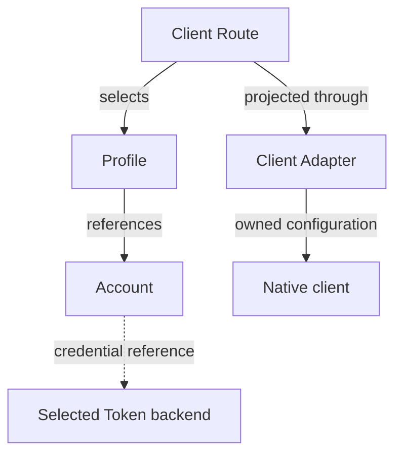

# Product Concepts

AIGW has four configuration entities: Account, Profile, Route, and Adapter.
A Route selects one Profile for one client; that Profile refers to an Account.



## Core entities

| Entity  | Meaning                                                                           | Cardinal rule                             |
| ------- | --------------------------------------------------------------------------------- | ----------------------------------------- |
| Account | Protocol endpoints and a logical credential boundary                              | Account Tokens are separate from Profiles |
| Profile | One `account + client + model` choice and optional Codex-native provider identity | Client scope is explicit                  |
| Route   | One client's explicit Profile selection                                           | No hidden provider fallback               |
| Adapter | Projection into one native client                                                 | Never writes another client's surface     |

### Account

An Account contains:

- a human label;
- an OpenAI Responses endpoint, an Anthropic endpoint, or both;
- an Account Token slot in the selected backend when authentication requires it;
- an optional provider-native diagnostic declaration.

Accounts can be imported before a Token is available. A client-native Profile
delegates authentication to its client instead of requiring that Account slot.
Configuration and manifests never contain the Token.
The reviewed distribution is [`manifests/team.toml`](../../manifests/team.toml);
it is the sole tracked team configuration and is directly consumable by
`aigw setup --from`.

### Profile

A Profile is the daily model choice for one client. The team manifest carries
the reviewed profile IDs and model IDs; operators select those IDs directly
instead of copying a second illustrative configuration.

Profile and model IDs are transparent operator-defined strings. AIGW does not
infer a provider, capability, or version policy from their spelling. A
Codex-scoped Profile may explicitly select one safe `model_provider`; omission
selects the canonical `aigw` provider. The selection is Profile-owned and never
falls back from Account metadata.

### Route

```bash
aigw use dmxapi-gpt-5.6-sol
aigw use dmxapi-claude-fable-5-1
```

Each Profile declares exactly one client. Selecting it replaces only that
client's Route. There is no global default, inheritance, or cross-client fallback.
AIGW selects before the request; it does not retry traffic through another
service or model.

### Adapter

| Adapter     | Projection                                                                                         |
| ----------- | -------------------------------------------------------------------------------------------------- |
| Codex       | Marked provider/model configuration; Account Token helper or explicit client-native authentication |
| Claude Code | Official user-settings endpoint/model projection and credential helper                             |

Adapters do not own provider behavior. Missing clients remain untouched.

## Endpoint

- Claude Code consumes the Account's Anthropic endpoint.
- Codex consumes the Account's OpenAI Responses endpoint.
- HTTPS is required except for an explicit loopback Account.
- A loopback process remains external to AIGW lifecycle ownership.

## Provider diagnostics

Routing and endpoint checks are provider-neutral. Exact balance or account state
is an optional leaf capability declared by `account_probe` and implemented by a
bundled diagnostic provider.

An unknown diagnostic kind does not invalidate the Account or Route. It makes
only the optional diagnostic unavailable.

## Manifest import

A token-free team manifest adds or reconciles public metadata. Same-named
Accounts and Profiles must match or import stops before mutation. Explicit
replacement changes metadata only; it never changes the Token slot.

## Rename

| Operation                   | Changes                               | Preserves                            |
| --------------------------- | ------------------------------------- | ------------------------------------ |
| `profile rename`            | Profile ID and Route references       | Account and Token                    |
| `account rename`            | Account ID and Profile references     | Token through a two-phase migration  |
| `account rename --finalize` | Removes verified old credential slots | Current configuration and checkpoint |

Finalize fails closed if credential equality or checkpoint proof is incomplete.

## Installation lifecycle

Each platform uses its matching archive and the same CLI-owned lifecycle: `aigw install`,
`aigw update`, `aigw update --rollback`, and `aigw uninstall`. Updates replace
the binary atomically and retain exactly one immediate predecessor. There is no
parallel package-manager channel.
