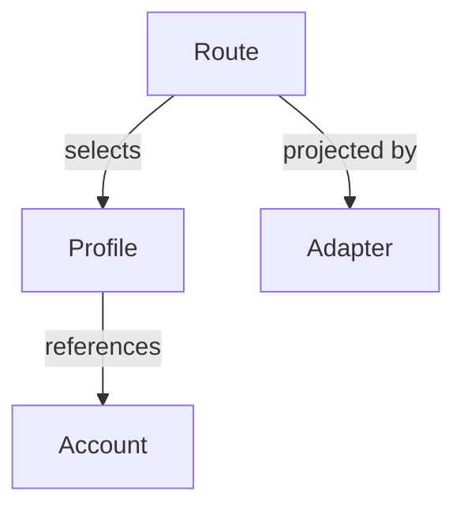

# Product Concepts

AIGW has four configuration entities: Account, Profile, Route, and Adapter.
A Route selects one Profile for one client; that Profile refers to an Account.
An Adapter projects that selection into its native client. Account Tokens stay
in a separate credential backend, not in the client configuration.



## Core entities

### Account

An Account contains:

- a human label;
- an OpenAI Responses endpoint, an Anthropic endpoint, or both;
- an Account Token slot in the selected backend when authentication requires it;
- an optional provider-native diagnostic declaration.

Accounts can be imported before a Token is available. A client-native Profile
delegates authentication to its client instead of requiring that Account slot.
Configuration and manifests never contain the Token.
The reviewed distribution is [`manifests/team.toml`](../../manifests/team.toml);
it is the sole tracked team configuration and is directly consumable by
`aigw setup --from`.

### Profile

A Profile is the daily model choice for one client. The team manifest carries
the reviewed profile IDs and model IDs; operators select those IDs directly
instead of copying a second illustrative configuration.

Profile and model IDs are transparent operator-defined strings. AIGW does not
infer a provider, capability, or version policy from their spelling. A
Codex-scoped Profile may explicitly select one safe `model_provider`; omission
selects the canonical `aigw` provider. The selection is Profile-owned and never
falls back from Account metadata.

Authentication defaults to `account-token`, which uses the Account's selected
Token backend. Codex Profiles alone may choose `client-native` with an explicit
`model_provider`: that client owns credentials and any signing, so AIGW does
not require an Account Token. This declaration is not evidence that the client
or provider supports the selected combination; verify the actual invocation.

### Route

```bash
aigw use dmxapi-gpt-5.6-sol
aigw use dmxapi-claude-fable-5-1
```

Each Profile declares exactly one client. Selecting it replaces only that
client's Route. There is no global default, inheritance, or cross-client fallback.
AIGW selects before the request; it does not retry traffic through another
endpoint or model.

Team recommendations are inputs to selection, not already selected Routes.
Import retains them separately. Setup and sync fill only unselected clients
from usable Profiles; an existing Route survives a missing Token or a newly
connected Account. See [team activation](../guides/team-rollout.md#local-choices)
for deliberate selection changes.

### Adapter

- **Codex:** recorded provider/model configuration, with an Account Token helper
  or explicit client-native authentication.
- **Claude Code:** official user-settings endpoint/model projection and
  credential helper.

An Adapter writes only its client's owned surface; it does not own provider
behavior. Missing clients remain untouched.

## Endpoint

- Claude Code consumes the Account's Anthropic endpoint.
- Codex consumes the Account's OpenAI Responses endpoint.
- HTTPS is required except for an explicit loopback Account.
- A loopback process remains external to AIGW lifecycle ownership.

## Provider diagnostics

Routing and endpoint checks are provider-neutral. Exact balance or account state
is an optional leaf capability declared by `account_probe` and implemented by a
bundled diagnostic provider.

An unknown diagnostic kind does not invalidate the Account or Route. It makes
only the optional diagnostic unavailable.

## Manifest import

A token-free team manifest adds or reconciles public metadata. Same-named
Accounts and Profiles must match or import stops before mutation. Explicit
replacement changes metadata only; it never changes the Token slot.

## Rename

- **`profile rename`**
  - **Changes:** Profile ID, Routes and recommendations
  - **Preserves:** Account and Token
- **`account rename`**
  - **Changes:** Account ID and Profile references
  - **Preserves:** Token through a two-phase migration
- **`account rename --finalize`**
  - **Changes:** Removes verified old credential slots
  - **Preserves:** Current configuration and checkpoint

Finalize fails closed if credential equality or checkpoint proof is incomplete.

## Installation lifecycle

Each platform uses its matching archive and the same CLI-owned lifecycle: `aigw install`,
`aigw update`, `aigw update --rollback`, and `aigw uninstall`. Replacement retains
exactly one immediate predecessor and restores the current program if activation
fails. It is recoverable replacement, not uninterrupted atomic visibility or
power-loss recovery. There is no parallel package-manager channel.

Before rollback, the retained program must start and read an isolated copy of
the current configuration. Incompatibility preserves the active program and
configuration; restoring compatible configuration is an explicit operator
decision, never a silent downgrade. See the [rollback journey](../../README.md#update-and-rollback).

`aigw installation --json` observes the command path, running version, resolved
program file and optional retained predecessor through one schema-versioned
file-identity contract. This is computed from existing files: no installation
registry, source checkout or Account configuration is needed. Digests describe
observed bytes; they do not certify release trust, rollback readiness or client
connectivity. Install, update, rollback, uninstall and inspection share one
predecessor-path rule.
