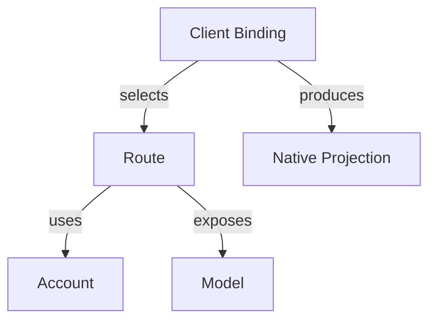

# Product Concepts

AIGW has five operational concepts: Account, Model, Route, Client Binding, and
Native Projection. A Client Binding selects one reusable Route for one client. The
Route refers to an Account, and the projection writes only AIGW-owned native
configuration. Account Tokens stay in a separate credential backend.



## Core entities

### Account

An Account contains:

- a human label;
- an OpenAI Responses endpoint, an Anthropic endpoint, or both;
- an Account Token slot in the selected backend when authentication requires it;
- an optional provider-native diagnostic declaration.

Accounts can be imported before a Token is available. A client-native Route
delegates authentication to its client instead of requiring that Account slot.
Configuration and manifests never contain the Token.
The reviewed distribution is [`manifests/team.toml`](../../manifests/team.toml);
it is the sole tracked team configuration and is directly consumable by
`aigw setup --from`.

### Model

A Model identifies one canonical upstream product independently of Account,
wire protocol, provider channel, recommendation, and client state.

### Route

A Route identifies one Account, one canonical Model, the exact upstream model
identifier, and the protocol interfaces qualified for that pairing. The team
manifest carries reviewed Models and Routes; operators may bind the same
compatible Route to more than one client.

Route and Model IDs are transparent operator-defined strings. AIGW does not
infer a provider, capability, or version policy from their spelling.

Authentication defaults to `account-token`, which uses the Account's selected
Token backend. A client binding may instead select admitted client-native
authentication and its native provider identity. That client then owns
credentials and any signing, so AIGW does not require an Account Token. This
declaration is not evidence that the client or provider supports the selected
combination; verify the actual invocation.

### Client Binding

```bash
aigw use --for codex dmxapi-gpt-6-astra
aigw use --for claude dmxapi-claude-fable-5-1
```

Each binding owns one client's Route selection, enabled intent, native target,
protocol, authentication mode, and genuinely client-specific options. There is
no global default, inheritance, or cross-client fallback. AIGW selects before
the request; it does not retry traffic through another endpoint or model.

Team recommendations are inputs to setup, not local bindings. Import retains
them separately. Setup may bind recommendations for explicitly connected
Accounts; `sync` only reconciles bindings that already exist. An existing
binding survives a missing Token or a newly connected Account. See
[team activation](../guides/team-rollout.md#local-choices) for deliberate
selection changes.

### Native Projection

- **Codex:** recorded provider/model configuration, with an Account Token helper
  or explicit client-native authentication.
- **Claude Code:** official user-settings endpoint/model projection and
  credential helper.

An admitted client adapter produces and withdraws only its AIGW-owned native
projection; it does not own provider behavior. Missing and unbound clients
remain untouched.

## Endpoint

- Claude Code consumes the Account's Anthropic endpoint.
- Codex consumes the Account's OpenAI Responses endpoint.
- HTTPS is required except for an explicit loopback Account.
- A loopback process remains external to AIGW lifecycle ownership.

## Provider diagnostics

Routing and endpoint checks are provider-neutral. Exact balance or account state
is an optional leaf capability declared by `account_probe` and implemented by a
bundled diagnostic provider.

An unknown diagnostic kind does not invalidate the Account or Client Binding. It makes
only the optional diagnostic unavailable.

## Provider catalogue lifecycle

Provider catalogues are observations, not configuration. `aigw catalog`
queries each configured Anthropic Messages, OpenAI Chat Completions, and OpenAI
Responses catalogue surface independently. Its source endpoint and content
identity make the result reproducible; membership proves neither inference nor
any capability.

The lifecycle uses existing owners rather than another state store:

| State      | Owner and meaning                                                                                               |
| ---------- | --------------------------------------------------------------------------------------------------------------- |
| Observed   | One successful, protocol-scoped catalogue response                                                              |
| Candidate  | An observed upstream ID with no matching Route on that Account and protocol                                     |
| Qualified  | Explicit protocol and real-client evidence for named capabilities                                               |
| Admitted   | A reviewed Route in configuration; omitted `lifecycle` means `admitted`                                         |
| Deprecated | A retained Route with `lifecycle = "deprecated"`; it may preserve an existing binding but cannot be recommended |
| Retired    | The Route has been explicitly removed after bindings and recommendations no longer require it                   |

Catalogue comparison uses `Route.upstream_model`, never the canonical Model ID.
A missing Route is reported for requalification; it is not renamed, deprecated,
retired, or removed automatically. Chat Completions success does not qualify
Responses, and Responses text success does not qualify reasoning, tools,
continuation, or compaction.

## Manifest import

A token-free team manifest adds or reconciles public metadata. Same-named
Accounts and Routes must match or import stops before mutation. Explicit
replacement changes metadata only; it never changes the Token slot.

## Rename

- **`route rename`**
  - **Changes:** Route ID, Client Bindings and recommendations
  - **Preserves:** Account and Token
- **`account rename`**
  - **Changes:** Account ID and Route references
  - **Preserves:** Token through a two-phase migration
- **`account rename --finalize`**
  - **Changes:** Removes verified old credential slots
  - **Preserves:** Current configuration and checkpoint

Finalize fails closed if credential equality or checkpoint proof is incomplete.

## Installation lifecycle

Each platform uses its matching archive and the same CLI-owned lifecycle: `aigw install`,
`aigw update`, `aigw update --rollback`, and `aigw uninstall`. Replacement retains
exactly one immediate predecessor and restores the current program if activation
fails. It is recoverable replacement, not uninterrupted atomic visibility or
power-loss recovery. There is no parallel package-manager channel.

Before rollback, the retained program must start and read an isolated copy of
the current configuration. Incompatibility preserves the active program and
configuration. `aigw config migrate --rollback` restores the exact retained
predecessor configuration; it does not reconstruct old state or touch client
files, sessions, or credentials. See the [rollback journey](../../README.md#update-and-rollback).

`aigw installation --json` observes the command path, running version, resolved
program file and optional retained predecessor through one schema-versioned
file-identity contract. This is computed from existing files: no installation
registry, source checkout or Account configuration is needed. Digests describe
observed bytes; they do not certify release trust, rollback readiness or client
connectivity. Install, update, rollback, uninstall and inspection share one
predecessor-path rule.

## Configuration migration

Normal commands read only the current schema. The explicit
`aigw config migrate --dry-run` operation is the sole reader for the immediately
preceding supported schema. Its preview lists retained Accounts, Routes,
recommendations, Client Bindings and native targets without reading Tokens or
writing client files. `aigw config migrate` commits the new schema with the
existing guarded configuration writer and retains the exact predecessor as the
single backup. `aigw config migrate --rollback` swaps that exact state back
before a program rollback; it never reconstructs historical configuration.
