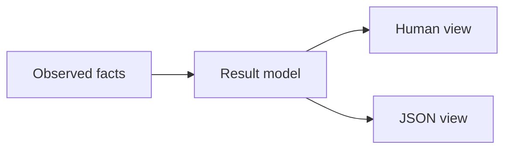

# Terminal Experience

AIGW human output answers three questions:

1. What is selected?
2. Is it ready?
3. What is the next safe action?

Readiness is decomposed rather than inferred. `status` reports selection and
local projection readiness without reading Tokens or invoking clients.
`check` adds endpoint checks; `verify --for <client>` runs a real client.
A synchronized projection is not proof of authentication or inference.
`sync` changes only AIGW-owned configuration, never client-owned credentials.

## Navigation

| Intent    | Commands                                                                                  |
| --------- | ----------------------------------------------------------------------------------------- |
| Connect   | `setup`                                                                                   |
| Daily use | `status`, `use`, `check`, `rotate`                                                        |
| Recover   | `doctor`, `repair`, `sync`, `rollback`, `update`                                          |
| Advanced  | `account`, `profile`, `route`, `adapter`, `config`, `catalog`, `models`, `test`, `verify` |

No alias exists only for presentation. The command grammar remains the
automation contract.

`aigw <command> --help` is the source-derived command reference. Cobra owns
command grammar, descriptions, examples and available subcommands; pflag owns
option notation, value types, declared defaults and inherited options. AIGW
adds journey grouping and terminal layout, not a second option-definition
table. Help is available before configuration and does not create local state.

Argument admission precedes configuration locking and command execution. An
explicit empty or whitespace-only update path is invalid, not an online-update
request. Manifest setup validates its path, explicit Account ID and option
combinations before creating configuration storage. Cobra remains the owner of
required flags and flag relationships; domain validation runs with the operation.

## Output model

| Surface  | Contract                                                       |
| -------- | -------------------------------------------------------------- |
| Human    | Task-first, aligned, width-aware, one safe next action         |
| JSON     | Stable machine fields; no terminal styling or width dependency |
| Error    | **Problem → Evidence → Impact → Recommended action**           |
| Pipeline | Plain text, no ANSI control sequences                          |

For a command whose parsed `--json` value is true, a failure before any result
is written produces one JSON document: `ok: false`, `error`, `next_action`, and
available `evidence` and `impact`. `--json=false` keeps human output; a literal
`--json` after `--` is an argument, not a formatting flag. Command-resolution
failures before flag parsing use human output.

Commands that already render their diagnostic result retain that result and a
nonzero exit status. A partial JSON write is not completed with prose or a
second document. Any command, output, or cleanup error remains a failure;
successful error rendering cannot turn it into success. Credential-helper
stdout carries only the requested credential, never root-level diagnostics.

## Layout

- Wide terminals use one aligned value column.
- Narrow terminals put the label and wrapped value on separate lines.
- Display width, not byte length, controls alignment.
- Words and paths are not split merely to fill a line.
- Color is optional and never carries meaning.
- Unknown output width uses a stable unbounded layout.

`COLUMNS` may provide an explicit positive width. JSON ignores it.

## Interaction

| Context                               | Behavior                                                |
| ------------------------------------- | ------------------------------------------------------- |
| Interactive, missing rename arguments | Prompt only for missing values                          |
| Non-interactive, missing arguments    | Fail immediately with an actionable message             |
| `--dry-run`                           | No mutation lock, credential write, or client execution |
| `--json`                              | Machine-readable output; execution behavior unchanged   |

## Troubleshooting journey

Use the least powerful command that answers the current question:

1. `aigw status` reports selected Routes and the next useful action.
2. `aigw check` validates configuration, credentials, installed-client
   projections, and selected endpoints without making a model request.
3. `aigw doctor` explains structural or host integration failures without
   mutation.
4. `aigw repair --dry-run --json` previews only AIGW-owned reconciliation;
   `aigw repair` applies that bounded plan.
5. `aigw test` tests the selected service endpoints; use `--for` or `--profile`
   to narrow it. With no selected Route it fails and recommends
   `aigw use <profile>` rather than reporting an empty success.
6. `aigw verify` is the explicit quota-consuming real model request.

`check` exits successfully when the enabled Routes pass their applicable
checks. With no enabled client, success covers configuration only. For
client-native authentication it checks the local projection without accessing
client credentials or calling the endpoint. An Account-Token Route also receives
an endpoint diagnostic; a successful response is not model or client proof.

The JSON vocabulary follows that evidence boundary:

| Field or state        | Exact meaning                                              |
| --------------------- | ---------------------------------------------------------- |
| `endpoint_configured` | The resolved Route contains an endpoint address.           |
| `adapter_ready`       | The local client projection passes inspection.             |
| `check_passed`        | This Route passed the checks applicable to its auth mode.  |
| `configured`          | Local prerequisites pass; no successful endpoint evidence. |
| `endpoint_checked`    | Local prerequisites and the endpoint diagnostic passed.    |
| `ok`                  | The command's applicable checks passed.                    |
| `next_action`         | The next explicit action, not necessarily a repair.        |

Model inference and real-client execution require their own verification;
neither `ok` nor `endpoint_checked` establishes them.

`doctor` uses the same outcome for human and JSON output. Failed diagnostics or
invalid, degraded, or unavailable client observations produce a nonzero exit
status and `ok: false`. Deferred clients are not failures by themselves. A JSON
report remains one document on failure, with `next_action` carrying the same
continuation shown in human output. Writing the report successfully does not
make a failed diagnosis successful.

For `sync` and `repair`, `--json` selects output format, not execution mode.
Add `--dry-run` to preview without writes; omit it to apply. A successful
result contains `dry_run` and `next_action`: previews point to the apply
command, while applied results point to `aigw check`. Projection plans appear
only in previews; applied output does not present an earlier plan as observed
per-target completion. Neither operation changes credentials.

An output failure after a successful commit does not undo the projection.
Inspect current state before retrying; generic error rendering cannot promise
rollback. Only the transaction owner can report completed compensation.

No recovery command edits conversation history, client-private databases,
Desktop-only settings, or an external compatibility service.

## Boundary language

A loopback endpoint is described only as an **external compatibility layer**.
AIGW does not infer the product, expose its port as an ownership claim, or
manage its lifecycle.

Client route commands manage AIGW Profile selection only. They do not inspect
or control IDEs, external proxies, desktop-only state, or conversations.
