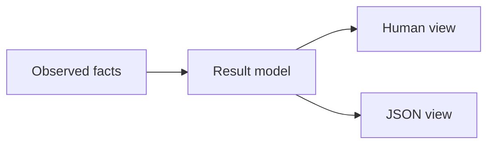

# Terminal Experience

AIGW human output answers three questions:

1. What is selected?
2. Is it ready?
3. What is the next safe action?

Readiness is decomposed rather than inferred. For Codex, a valid AIGW-owned
projection and a readable Account Token do not prove native authentication.
`status` observes the public `codex login status` surface for each selected
Codex Home and recommends `aigw adapter auth codex` when authentication remains
unproved. `sync` never performs that mutation.

## Navigation

| Intent    | Commands                                                                                  |
| --------- | ----------------------------------------------------------------------------------------- |
| Connect   | `setup`                                                                                   |
| Daily use | `status`, `use`, `check`, `rotate`                                                        |
| Recover   | `doctor`, `repair`, `sync`, `rollback`, `update`                                          |
| Advanced  | `account`, `profile`, `route`, `adapter`, `config`, `catalog`, `models`, `test`, `verify` |

No alias exists only for presentation. The command grammar remains the
automation contract.

## Output model

| Surface  | Contract                                                       |
| -------- | -------------------------------------------------------------- |
| Human    | Task-first, aligned, width-aware, one safe next action         |
| JSON     | Stable machine fields; no terminal styling or width dependency |
| Error    | **Problem → Evidence → Impact → Recommended action**           |
| Pipeline | Plain text, no ANSI control sequences                          |

## Layout

- Wide terminals use one aligned value column.
- Narrow terminals put the label and wrapped value on separate lines.
- Display width, not byte length, controls alignment.
- Words and paths are not split merely to fill a line.
- Color is optional and never carries meaning.
- Unknown output width uses a stable unbounded layout.

`COLUMNS` may provide an explicit positive width. JSON ignores it.

## Interaction

| Context                               | Behavior                                                  |
| ------------------------------------- | --------------------------------------------------------- |
| Interactive, missing rename arguments | Prompt only for missing values                            |
| Non-interactive, missing arguments    | Fail immediately with an actionable message               |
| `--dry-run`                           | No mutation lock, credential binding, or client execution |
| `--json`                              | No prompt, style, secret, or private path                 |

## Boundary language

A loopback endpoint is described only as an **external compatibility layer**.
AIGW does not infer the product, expose its port as an ownership claim, or
manage its lifecycle.

Client route commands manage AIGW Profile selection only. They do not inspect
or control IDEs, external proxies, desktop-only state, or conversations.
