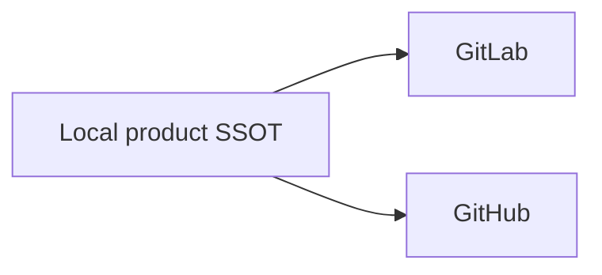

# Change and Release Policy

## Authority Map

| Surface | Authority |
|---|---|
| Product version | `VERSION` |
| Release chronology | `CHANGELOG.md` |
| Product commit and tag objects | Local Git |
| Change intent and behavioral deltas | Active OpenSpec Change |
| Accepted behavior | `openspec/specs/` |
| Toolchain versions | `go.mod`, `go.sum`, `mise.toml`, `mise.lock` |
| CI topology | `.config/ci/pipeline.cue` |
| Coverage policy | `.config/checks/coverage/policy.toml` |
| Release assets | Repository release tools and their manifests |

Generated workflows, installed binaries, host caches, IDE state, Forge pages,
and remote refs are projections—not competing authorities.

## Change Lifecycle

An accepted `dev` or `main` tree contains only archived Changes and canonical
specifications. Authoring occurs in an owned work lane with one active Change.
The Change states why behavior changes, its complete contract delta, design
decisions, bounded tasks, and authority scope.

Completion order is:

```text
implementation
  -> local quality graph
  -> exact-HEAD proof
  -> archive
  -> accepted local refs
  -> optional hosted CI and publication
  -> installation and runtime acceptance
  -> lane retirement
```

External publication is not a prerequisite for local acceptance. It is a
separate delivery boundary consuming the immutable accepted result.

## Commit and Tag Identity

One product commit or annotated tag is constructed and signed once in local
Git. GitLab and GitHub receive that exact object unchanged. Therefore every new
publication must preserve:

- commit OID;
- annotated tag OID;
- peeled commit and tree;
- author and committer identity stored in the commit;
- tag annotation and product signature.

Product signing and peer transport authentication are independent. GitLab and
GitHub may use different SSH keys, PATs, OIDC identities, or host credentials
for transport without changing the product object. A host's `Verified` display
is an account-level projection, not product identity authority.

The following have no valid steady-state role:

- provider-specific history replay;
- identity rewriting;
- provider-qualified tag namespaces;
- commit maps or continuity receipts;
- tree-only or suffix-only parity;
- per-peer re-signing of a product tag.

## Independent Forge Publication

Local operation with zero peers remains complete. GitLab and GitHub are
optional, equivalent, independent peers:



One peer never queries, downloads from, repairs, or authorizes the other. A
failed peer is reported incomplete while local operation and the other peer
continue independently.

Branch publication accepts only `main` and `proposal/*`:

- `main` atomically updates peer `main` and `dev` to one exact local commit;
- `proposal/*` updates only the matching peer ref;
- `dev`, `candidate/*`, `work/*`, and arbitrary feature refs are rejected.

New refs use a zero-OID lease. An equal or fast-forward peer update is ordinary
publication. A divergent one-time cutover requires the fresh exact old OID for
every selected ref and uses `--force-with-lease`. Protected-branch force push is
enabled only for that bounded transaction and restored immediately afterward.

Formal tags are immutable product evidence. Old released tags are retained
unless a separate inventory proves they are failed intermediate artifacts and
authorizes deletion. Every new formal tag is exact across local Git and all
selected peers.

## Release Chronicle

`CHANGELOG.md` starts with `## [Unreleased]` and contains only changes after the
latest published version. Published headings are unique SemVer entries in
descending order and correspond to an existing signed `v<semver>` tag and its
date. `VERSION` is the release-version SSOT; branch names and planned versions
are not chronology.

A tag proves source identity, not asset publication, native-platform
acceptance, signing, notarization, installation, or runtime health. Those
claims require separate current evidence.

## Reproducible Assets

The formal release derives its exact compiler from `go.mod`, dependency closure
from `go.sum`, repository tools from `mise.toml` and `mise.lock`, and
`SOURCE_DATE_EPOCH` from the committed Changelog date. The build emits the
complete portable archive matrix, checksums, and SPDX SBOM. Repeating the build
with the same inputs must produce identical bytes.

Each selected Forge creates its own Release record and publishes the same asset
matrix. When both are reachable, compare every filename and digest. One peer's
assets are never an input to the other peer's build.

## Quality and Platform Evidence

The CUE CI authority projects GitLab and GitHub workflow syntax from one logical
quality graph. Product evidence and a Forge's runner capacity are distinct:

- a developer proposal is verified on review into `dev`, not once on push and
  again on review;
- a maintainer publication verifies the exact accepted object on `main`, while
  the equal `dev` ref remains a distribution peer rather than a second evidence
  owner;
- tags and explicit manual dispatches remain distinct release and diagnostic
  lifecycle stages;
- macOS, Linux, and Windows product support requires native evidence across the
  admitted aggregate evidence set;
- a Forge without a qualified executor omits that job rather than creating an
  indefinitely pending or `allow_failure` substitute;
- cross-compilation proves package construction, not native execution;
- rooted macOS package lifecycle remains a GA gate.

Coverage includes every Go package. Aggregate statement and branch coverage
must each remain strictly above 95 percent with exact raw evidence. Formatting,
static analysis, documentation links, OpenSpec validation, architecture,
security, release construction, and installation are independent gates.

## Branch and Worktree Closeout

A merged delivery branch is disposable. Remove its worktree before deleting
the local branch and remote proposal ref. Retirement requires current proof
that:

1. the branch tip is reachable from accepted local `main`;
2. every reachable selected peer exposes that exact accepted product commit;
3. the worktree is clean and no live owner still needs it;
4. the branch is neither protected nor an active unmerged delivery branch.

An unreachable peer warrants a recorded incomplete probe, not invented parity.
Release tags remain product evidence and are not branch residue.

## Product Boundary

AIGW owns Accounts, credentials, Profiles, Routes, storage policy, and explicit
client projections. It does not carry API traffic, manage an external proxy,
control IDE state, or mutate Codex JSONL, SQLite, historical messages, or model
metadata. Optional Responses services are ordinary configured endpoints and
own their own deployment and runtime lifecycle.
