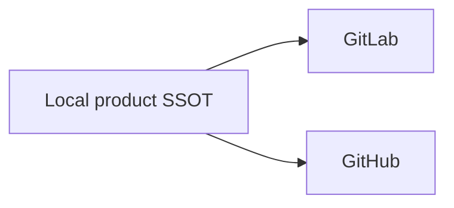

# Change and Release Policy

## Authority Map

| Surface                             | Authority                                    |
| ----------------------------------- | -------------------------------------------- |
| Product version                     | `VERSION`                                    |
| Release chronology                  | `CHANGELOG.md`                               |
| Product commit and tag objects      | Local Git                                    |
| Change intent and behavioral deltas | Active OpenSpec Change                       |
| Accepted behavior                   | `openspec/specs/`                            |
| Go dependency closure               | `go.mod`, `go.sum`                           |
| Runtime and standalone tools        | `mise.toml`, `mise.lock`                     |
| npm repository tools                | `package.json`, `package-lock.json`          |
| CI topology                         | `.config/ci/pipeline.cue`                    |
| Coverage policy                     | `.config/checks/coverage/policy.toml`        |
| Go source file budget               | `.config/checks/go/size.toml`                |
| Release assets                      | Repository release tools and their manifests |

Generated workflows, installed binaries, host caches, IDE state, Forge pages,
and remote refs are projections—not competing authorities.

Repository placement follows the consumer, not a preference for hidden files:

- Root discovery files retain their native names: Git attributes and ignores,
  EditorConfig, npm metadata and registry selection, Go modules, mise tools and
  locks, formatter ignores, and the GitLab entrypoint.
  `.cbmignore` controls optional developer indexing, not product quality or
  acceptance; it belongs with development-tool inputs.
- `.config/checks` contains policy data only. Go, Markdown, TOML and secret
  scanning each have one native configuration; architecture and coverage each
  have one product-policy input consumed by their existing repository tool.
  Check implementation belongs in `tools`, not beside configuration data.
- `.config/miserc.toml` owns native early mise configuration discovery. Its
  parent-search boundary cannot live in `mise.toml`, which is read afterward.
  Tool versions and tasks remain in the existing mise declaration and lock.
- `.config/ci/pipeline.cue` owns the Forge projections;
  [.config/release/goreleaser.yaml](../../.config/release/goreleaser.yaml) owns
  archive construction; the dependency policy owns proposal grouping. Their
  different consumers and lifecycles justify separate configuration owners.
- `.ethos` holds declarative adoption, ref roles and publication bindings.
  ETHOS owns hooks and transient coordination; AIGW must not add a second hook
  framework or copy the lifecycle engine to enforce the same policy.
- OpenSpec owns current intent and canonical requirements; contributor and
  product documents own explanation and navigation. Runtime state, tool caches
  and verification output are not tracked policy inputs. Their locations and
  cleanup follow [output ownership](../../CONTRIBUTING.md#output-ownership-and-cleanup).

Optional configuration that merely repeats locked defaults should be removed
with its command and documentation consumers. Native discovery files and locks
are not optional wrappers. The shared CI executor streams its checkout-bound
Git inventory to Prettier's native API, which applies locked defaults without
configuration discovery. Tracked files remain in scope even when `.gitignore`
matches them; `.prettierignore` excludes only official OpenSpec archive history.
Missing inputs and a scope with no supported authored files fail the check.
EditorConfig owns editor defaults and its independent native check, not
Prettier options. No default-only or ambient parent formatter configuration is used.
Taplo likewise declares only intentional deviations from locked defaults:
preserve multiline arrays, use a 100-column layout target and compact inline
tables. Native conformance preserves key and array order; neither formatter
configuration nor dependency upgrades may silently reorder authored semantics.

## Dependency and Framework Admission

Prefer maintained native tools and libraries when they reduce the total
implementation, verification, security, or operating burden. Compare production
code, tests, transitive dependencies, runtime state, platform behavior, and
upgrade cost; neither fewer lines nor a larger feature list establishes value.

A dependency Change must identify the responsibility being replaced, demonstrate
the benefit against the existing implementation, and verify affected product
contracts. Delete superseded mechanics in the same Change. A material security
or portability improvement may justify additional code when its evidence and
trade-offs are explicit.

Keep candidate comparisons and measurements in the proposing Change or
[research](../research/provider-tooling-assessment.md); record adopted choices
and rationale in the [decision register](../decisions/decision-register.md).
This policy defines admission criteria, not a permanent list of rejected tools.

## Dependency Maintenance

[Renovate policy](../../.config/dependencies/renovate.json5) is the single
dependency-proposal policy. Its native Go, npm, and
[mise manager](https://docs.renovatebot.com/modules/manager/mise/) read the
existing manifests and locks. Three declarative extractors cover Actions and
images in the CUE authority and the mise bootstrap version; generated Forge
files are never dependency inputs. Dependabot's
[supported ecosystems](https://docs.github.com/en/code-security/reference/supply-chain-security/supported-ecosystems-and-repositories)
do not cover the declared mise closure; a second updater would create competing
proposals.

The pinned, disposable Renovate container is maintenance tooling, not an AIGW
runtime or ordinary development prerequisite. On a host with a Linux-container
engine, run:

```bash
mise run dependencies:check
mise run dependencies:inspect
```

The first command runs Renovate's strict repository-config validator. The
second extracts the managed inventory with networking disabled and a read-only
checkout. Neither mounts credentials, Git signing material, the Docker socket,
or a user home. The offline extractor disables only Renovate's lookup-token
warning: it makes no lookup and provides no freshness or vulnerability claim.
Both containers remove their writable temporary state on exit. This container
workflow was exercised on macOS; Windows-host invocation is not yet evidenced.

Normal releases wait three days before proposal creation, covering npm's
initial unpublish window. Missing publication timestamps are not guessed.
Go and repository-tool updates are grouped separately; only non-major updates
of already-stable dependencies qualify for automatic merge. Toolchains, Actions,
images, pre-1.0 dependencies, and major upgrades require deliberate admission.
OSV security fixes bypass the age delay and ordinary proposal quota, not quality
or signing requirements. The existing OSV gate still owns full-lock scanning;
Renovate's OSV integration covers direct dependencies only.

The scoped npm override for markdownlint-cli2 selects smol-toml 1.8.0 because
markdownlint-cli2 0.23.2 pins vulnerable 1.7.0. This addresses
[GHSA-7w5x-hrqm-74c2](https://github.com/advisories/GHSA-7w5x-hrqm-74c2)
without adding a direct dependency or patching vendor code. Remove the override
when the admitted markdownlint-cli2 release resolves a non-vulnerable version
itself; registry integrity and the native Markdown checks remain required.

Mermaid validation uses the development-only `@mermaid-lint/core` package,
which calls Mermaid's parser without installing a browser in CI. Its scoped
jsdom override selects 29.1.1 to remove the deprecated encoding dependency in
the upstream 26.x range. The newer 30.0.1 resolution was not admitted: npm
advertised provenance for its whatwg-url 17.1.1 dependency, but the attestation
endpoint returned 404 and remains unavailable on the current supply refresh.
This is an explicit supply-chain exception,
not a claim that 29.1.1 is latest. Reconsider the override when the upstream
range removes deprecated dependencies and the complete resolution passes
registry signatures, provenance, vulnerability and diagram conformance checks.

Activation requires one operator-owned runner for one selected proposal peer,
with local commit signing, an admitted OpenSpec Change, and current-commit CI.
The peer is a deployment choice, not a product dependency. An automatic merge
must preserve the signed object through fast-forward; if the peer cannot do
that, use the existing maintainer publication path rather than rebase or
re-sign. Refresh locks through native package managers and regenerate Forge
projections through `go run ./tools/ci project` before verification. Protected
runner settings, credentials, schedules, and generic Change admission belong
to the execution/governance owner, not this policy or a new AIGW updater.

## Change Lifecycle

[Workspace branch roles](../../.ethos/workspace.toml) distinguish accepted
integration (`dev`) from release (`main`). Both publication trees contain
archived Changes and canonical specifications. One owned work lane carries the
active Change's intent, contract delta, design and progress; a `proposal/*` ref
is its review projection, not another authoring lane.

ETHOS owns write admission, proof, archive, integration and retirement. Start
with its current `status --json` result in the exact checkout and follow the
public continuation rather than treating this document as a second state
machine. AIGW declares its [product gates](../../.ethos/profile.toml) and
[publication surfaces](../../.ethos/release.toml); those declarations do not
replace generic lifecycle authority.

Product acceptance, release publication, installation and lane retirement are
distinct claims. A local-only acceptance claims no hosted delivery. An installed
product requires native artifact evidence, not merely an accepted source tree.

Candidate startup verification owns and removes its temporary executable before
installation replacement. Cleanup uses
[`robustio.RemoveAll`](https://github.com/rogpeppe/go-internal/tree/v1.16.0/robustio)
for bounded handling of transient platform file locks after execution. Persistent
cleanup failure still aborts the update and preserves the installed program;
AIGW adds no retry loop, delayed cleanup service, or retained candidate directory.

Program replacement stages durable bytes through the shared transaction owner,
then uses the existing filesystem library's bounded rename operation. It never
retries an entire update or deletes the previous program before the first rename
succeeds. Activation failure restores the current program; restoration failure
reports both causes and leaves that program at its rollback path. Update and
rollback use this same operation. Two renames provide recoverable replacement,
not uninterrupted atomic visibility or power-loss recovery.

Native Windows conformance holds real file handles without delete sharing and
first observes the failed replacement using the same source and destination as
the product. It preserves that native error rather than assuming source locks
and destination locks return the same error code. Update and rollback each cover
current-program and predecessor locks, with both delayed release and persistent
failure. A separate candidate-source lock covers activation retry and restoration
of the current program after failed activation. Every case checks exact surviving
bytes and directory membership; the native library owns retry timing. Compilation
and cross-target lint do not establish Windows execution.

## Commit and Tag Identity

One product commit or annotated tag is constructed and signed once in local
Git. GitLab and GitHub receive that exact object unchanged. Therefore every new
publication must preserve:

- commit OID;
- annotated tag OID;
- peeled commit and tree;
- author and committer identity stored in the commit;
- tag annotation and product signature.

Commit subjects must match the complete `subject_pattern` from the selected
revision's [workspace policy](../../.ethos/workspace.toml), not a matching
substring. Forge verification applies that rule even when the configured
expression omits anchors. Release tags use `v` followed by strict SemVer;
individual-tag and tag-set checks share the existing SemVer library used by
release construction, including prerelease and build-metadata syntax.

Product signing and peer transport authentication are independent. GitLab and
GitHub may use different SSH keys, PATs, OIDC identities, or host credentials
for transport without changing the product object. A host's `Verified` display
is an account-level projection, not product identity authority.

The following have no valid steady-state role:

- provider-specific history replay;
- identity rewriting;
- provider-qualified tag namespaces;
- commit maps or continuity receipts;
- tree-only or suffix-only parity;
- per-peer re-signing of a product tag.

## Independent Forge Publication

Local operation with zero peers remains complete. GitLab and GitHub are
optional, equivalent, independent peers:



One peer never queries, downloads from, repairs, or authorizes the other. A
failed peer is reported incomplete while local operation and the other peer
continue independently.

Release metadata and upload requests use the selected endpoint without following
redirects. Artifact downloads retain native CDN redirects, the caller's stricter
redirect policy and the native default request bound. A different scheme, host
or effective port removes publication credentials for the remaining redirect
chain; returning to the original host does not restore them. HTTPS never
downgrades to HTTP. Direct asset links carry credentials only at the selected
API authority. GitHub's returned upload URL remains its explicit upload target,
including a distinct upload host, but must be an absolute HTTP(S) URL without
user information and must preserve HTTPS. These rules are enforced within the
existing publication owner, without changing shared HTTP clients or adding
request retries.

Branch publication accepts only `main` and `proposal/*`:

- `main` atomically updates peer `main` and `dev` to one exact local commit;
- `proposal/*` updates only the matching peer ref;
- `dev`, `candidate/*`, `work/*`, and arbitrary feature refs are rejected.

New refs use a zero-OID lease. An equal or fast-forward peer update is ordinary
publication. A divergent one-time cutover requires the fresh exact old OID for
every selected ref and uses `--force-with-lease`. Protected-branch force push is
enabled only for that bounded transaction and restored immediately afterward.

Formal tags are immutable product evidence. Old released tags are retained
unless a separate inventory proves they are failed intermediate artifacts and
authorizes deletion. Every new formal tag is exact across local Git and all
selected peers.

## Release Chronicle

`CHANGELOG.md` starts with `## [Unreleased]` and contains only changes after the
latest published version. Published headings are unique SemVer entries in
descending order and correspond to an existing signed `v<semver>` tag and its
date. `VERSION` is the release-version SSOT; branch names and planned versions
are not chronology.

Changelog headings and selected tags use the existing strict SemVer library
shared by release construction and update admission, not a second regex or
integer-based comparator. Build metadata belongs to exact release identity but
does not change precedence. A single entry may include metadata; two entries
that differ only by metadata cannot satisfy strict descending order. Tag and
release-epoch lookup preserve the complete version text. Unsupported numeric
core values fail rather than silently overflowing a machine integer.

A tag proves source identity, not asset publication, native-platform
acceptance, signing, notarization, installation, or runtime health. Those
claims require separate current evidence.

## Reproducible Assets

The formal release derives its exact compiler and Go closure from `go.mod` and
`go.sum`, language runtimes and standalone tools from `mise.toml` and
`mise.lock`, npm repository tools from `package.json` and `package-lock.json`,
and `SOURCE_DATE_EPOCH` from the committed Changelog date. The build emits the
complete portable archive matrix, checksums, and SPDX SBOM. Repeating the build
with the same inputs must produce identical bytes.

An untagged candidate uses the distinct version in `VERSION`. Until that
version has a published Changelog entry, its reproducible timestamp comes from
the exact source commit, not the wall clock or an invented release heading.
Tagged release builds still require the matching release chronicle. Candidate
construction does not create a tag, publish assets, or update an installation.

Each selected Forge creates its own Release record and publishes the same asset
matrix. When both are reachable, compare every filename and digest. One peer's
assets are never an input to the other peer's build.

## Quality and Platform Evidence

### Scope and authority

The [CI routing decision](../decisions/dr-0010-lifecycle-scoped-ci-evidence.md)
owns review, accepted-branch, release-branch and tag evidence. CUE reads the
workspace's branch roles and projects the same required checks to both Forges.
The [contribution workflow](../../CONTRIBUTING.md#development-and-verification)
owns executable commands and environment preparation; this section owns
acceptance criteria and the reasons for them. Measurements and remediation
progress belong to the active OpenSpec Change, not this durable policy.

Each gate must use the selected checkout and its declared inputs. Current tracked
files remain in scope even when ignored by Git; nonignored untracked source is
also checked. Inherited alternate indexes, parent configuration and sibling
installations cannot redefine the selected scope. Missing inputs, empty required
scopes, incomplete results and nonzero validator exits fail the gate.

| Concern                                      | Execution owner                                                                              | Acceptance boundary                                                                                                     |
| -------------------------------------------- | -------------------------------------------------------------------------------------------- | ----------------------------------------------------------------------------------------------------------------------- |
| Text, formatting, documentation and diagrams | [Text layout policy](text-layout.md) and native formatters, markdownlint, Mermaid and lychee | Exact source inventory, valid local links and source-preserving checks; rendered and external-link evidence is separate |
| Go correctness and structure                 | [Native Go policy](../../.config/checks/go/policy.yml)                                       | Product, tools, tests and each platform-selected source set; one shared lint policy                                     |
| Package ownership and dependencies           | [Architecture policy](../../.config/checks/architecture/policy.toml)                         | Unique semantic ownership, admitted imports and composition boundaries                                                  |
| Behavioral coverage                          | [Coverage policy](../../.config/checks/coverage/policy.toml)                                 | Complete package observation and exact native Go statement counts                                                       |
| Authored Go file size                        | [Size policy](../../.config/checks/go/size.toml) and SCC                                     | Complete file measurements, including tests and platform variants                                                       |
| Configuration semantics                      | The consuming tool's native schema or product validator                                      | Syntax alone is insufficient; unknown fields, invalid values and missing schemas fail                                   |
| Dependencies and credentials                 | Native vulnerability, signature, provenance, license and secret checks                       | Required current evidence and redacted findings; no silent network or scope fallback                                    |
| Artifacts and installation                   | Release construction and native lifecycle acceptance                                         | Exact artifact identity, supported-platform execution and preserved user state                                          |

Architecture classification proves ownership, not effective check coverage.
A new carrier needs every applicable native check; it must not be accompanied
by a parallel check registry or a copied generic parser. Native schemas remain
with their locked package owners. External schema references are not fetched
implicitly during local policy validation.

The [ETHOS gate declarations](../../.ethos/profile.toml) describe execution
requirements, not a sandbox. Gates may create disposable verification output.
Behavior tests use prepared tools and local fixtures; the quality gate requires
network evidence for npm signatures and OSV. A warm-cache success is not an
offline or fresh-download proof. Output lifetime follows
[operation ownership](../../CONTRIBUTING.md#output-ownership-and-cleanup).

### Native platform evidence

Product support requires native evidence for macOS, Linux and Windows across
the admitted aggregate evidence set. A Forge without a qualified executor omits
that job rather than substituting an indefinitely pending or allowed-to-fail
job. Runner availability is not a product capability, and cross-compilation
proves construction rather than native execution. Rooted macOS package-lifecycle
acceptance remains a GA gate.

Every native job runs the shared Go static policy before behavioral tests and
release acceptance. Another platform's result cannot substitute for the selected
OS sources. Native vet already runs within that policy; a separate invocation
must justify a distinct scope rather than repeat the same check.

Windows FFI annotations are restricted to the operation that requires the native
ABI. Job information stays pinned through the syscall, DPAPI buffers are copied
before release, and credential observation reads metadata rather than Token
blobs. A library that reads credential values cannot replace metadata-only
observation merely to reduce custom code. No annotation exempts an entire
package or unrelated call.

### Behavioral and quantitative evidence

The coverage policy owns the strict **greater-than 95-percent** aggregate
statement floor. Every canonical production package remains visible and every
package with measurable statements must execute owned statements. Counter-free
packages require Go-selected source evidence of declarations without function
bodies; native zero-statement counters report not applicable. Neither case is
zero or 100-percent coverage. Package ratios are reported for review, not used
as a second independent percentage veto.

Instrumentation and observation share the exact sorted Go package inventory.
Undeclared counters fail admission rather than changing the denominator. A
relative package pattern must not accidentally instrument a checkout-local
compiler or dependency. Raw counts, package identity, revision, tree, toolchain
and policy digest remain part of the evidence. Statement coverage cannot be
relabeled as branch coverage; an unsupported analyzer or inferred metric is not
an acceptable substitute.

The machine policies own blocking values. The following table explains their
current meaning and review trade-offs; it is not a second executable policy.
The same boundaries apply to product, tooling and tests.

| Measurement       | Boundary                     | Protected risk and limitation                                                                                                           |
| ----------------- | ---------------------------- | --------------------------------------------------------------------------------------------------------------------------------------- |
| SCC code lines    | At most 500 per Go file      | Bounds traversal; includes inline-comment code but excludes blank and comment-only lines. It is not executable statement count.         |
| Cyclop            | At most 25                   | Bounds decision-path score, including boolean operators and switch cases. It does not count executable paths or prove test adequacy.    |
| Gocognit          | At most 45                   | Bounds nested control flow, including function literals. A low score does not establish a deep module.                                  |
| Funlen span       | At most 120 physical lines   | Keeps an operation inspectable; blank lines and multiline data count. Dense formatting is not remediation.                              |
| Funlen statements | At most 60                   | Bounds selected AST statement forms. Its traversal does not cover every callback or branch form.                                        |
| Revive arguments  | At most seven                | Bounds named declaration parameters; receivers, unnamed parameters and function literals have different analyzer coverage.              |
| Nestif            | Reject score five or greater | Bounds nested conditional reasoning, not indentation depth or all loop and switch complexity.                                           |
| Maintidx          | At least 25                  | Combines span, vocabulary and cyclomatic complexity; large cohesive data can score poorly despite simple control flow.                  |
| Dupl              | 100-token threshold          | Detects serialized syntax-tree similarity, not repeated responsibility; names and literal values do not distinguish matching structure. |

These distinctions follow the locked analyzers, including
[funlen traversal](https://github.com/ultraware/funlen/blob/v0.2.0/funlen.go),
[Revive arguments](https://github.com/mgechev/revive/blob/v1.15.0/rule/argument_limit.go),
[maintainability](https://github.com/yagipy/maintidx/blob/v1.0.0/visitor.go) and
[clone detection](https://github.com/golangci/dupl). A passing result does not
establish coverage outside their actual syntax or platform scope.

Lower values require demonstrated semantic benefit, not only a successful run:

- Complete artifact, projection and credential transactions retain their
  ordered checks and compensation. Splitting one transaction into forwarding
  helpers to meet a lower decision count hides rather than removes complexity.
- Complete acceptance journeys retain intermediate states and exact preservation
  assertions. Reducing their score by weakening assertions is not admissible.
- A parameter object is justified by a reusable domain concept, not by grouping
  unrelated values to evade an argument count.
- A declarative table may legitimately occupy many lines with little control
  flow. Span and maintainability must not reward compressed, unreadable data.
- Similar DPAPI protection and unprotection adapters own distinct native
  operations. Clone findings require same-owner analysis before consolidation;
  a host-only trial cannot justify a cross-platform threshold.

Reassess a limit when an escaped defect exposes an unprotected risk or repeated
cohesion-preserving changes are blocked. Keep every other gate, source category
and assertion intact during a trial. Prefer deletion, reduced state and clearer
ownership to extra indirection, exclusions, suppressions or maximum-plus-one
thresholds. No metric or trial establishes a universal optimum.

Maintainability diagnostics remain visible even when a different rule rejects
the same function. Native conformance covers both product and test source;
a stricter threshold is not proven merely by a clean repository scan.

### Check effectiveness and failure semantics

Cross-checkout conformance runs the native commands against boundary pairs,
product and test sources, foreign platform selections and unchanged source
bytes. Removing the intended rule must invalidate its own expected rejection.
Analyzer diagnostics retain all applicable rules at a source line rather than
hiding one behind another. Conformance proves the selected check; it does not
by itself prove hosted routing or implementation completeness.

Correctness analysis includes native vet nilness and unused-write checks and
checked dynamic type assertions. Fixtures should retain concrete dependencies
rather than recover known types from broad interfaces. Additional analyzers
need a correctness or performance rationale; enabling every advisory rule is
not automatically a stronger policy.

Every discarded error requires a reason at its owner. Gate progress must be
writable before the gate executes, and a result-write failure must not report
success. After a verified publication, the error identifies the completed
external effect and failed report delivery; it does not roll back or repeat
publication. Read-only close errors and infallible in-memory operations have
different consequences from failed durable writes and must be reviewed as such.

Security scanning covers current regular source files with path policy intact;
symlink targets and ignored untracked output remain outside that source scope.
A current-file scan does not prove history was scanned. Output is redacted,
input bytes stay unchanged, and private projections are reclaimed on success
and failure. Coverage, security, type, dependency, documentation and lifecycle
checks remain independent obligations.

### Performance and completion claims

Compare startup, projection latency, credential access, memory and artifact size
against the retained installed baseline on the supported platforms. Measurements
identify their exact source and artifact, environment, method and uncertainty.
A regression needs a product benefit and an explicit accepted trade-off, or
remediation through less allocation, I/O, state or redundant implementation.
Old host measurements are not current budgets or evidence of improvement.

Every completion claim names its scope, verifier, current evidence and limit.

| Claim                       | Required evidence                                                                                                        | Insufficient evidence                                     |
| --------------------------- | ------------------------------------------------------------------------------------------------------------------------ | --------------------------------------------------------- |
| Source is releasable        | Clean exact revision, complete quality graph, package-observed statement coverage, race detection and product signatures | An old log, an excluded package or an inferred metric     |
| Artifact matrix is complete | Two deterministic builds from one version, epoch, toolchain and source; identical archives, checksums and SPDX SBOM      | A partial matrix or merely equivalent content             |
| Installation works          | Native install, update, rollback and uninstall of the candidate archive on every supported OS                            | Cross-compilation or archive inspection                   |
| Client integration works    | Real Codex and Claude invocations through the exact installed artifact and selected Route                                | Valid settings, an endpoint probe or an unrelated session |
| Release is published        | Successful tag pipeline and independent inspection of each selected peer's Release and assets                            | A local build directory or source tag                     |
| GA is trusted               | Protected signing-policy verification and post-signature checksums for exact published assets                            | An unsigned prerelease or local identity inspection       |

Projection evidence includes the dry-run, all-target transaction, byte-exact
compensation and resulting diagnostics. The endpoint owner supplies transport
and service evidence. A configured loopback URL proves neither listener health
nor ownership. User-visible claims require observation in the named client
context rather than inference from configuration or transport health.

## Branch and Worktree Closeout

Proposal cleanup follows acceptance into `dev` and closure of its review; it
does not wait for independent promotion to `main`, installation, or another
peer's availability. Verify the exact source object is accepted before removing
the selected remote review ref. Worktree and local-ref retirement use ETHOS's
current exact-target decision, including content preservation and live ownership,
rather than a separate AIGW retirement checklist.

A peer that cannot be observed remains unverified: defer that peer's effect,
not unrelated local product work. Published tags and rollback artifacts retain
their consumers and require a separate deletion inventory. Object-database
cleanup is storage maintenance, not evidence of release or product completion.

## Product Boundary

AIGW owns Accounts, credentials, Profiles, Routes, storage policy, and explicit
client projections. It does not carry API traffic, manage an external proxy,
control IDE state, or mutate Codex JSONL, SQLite, historical messages, or model
metadata. Optional Responses services are ordinary configured endpoints and
own their own deployment and runtime lifecycle.
