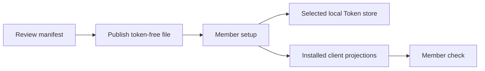

# Team Rollout

A team distributes reviewed public configuration; each member supplies Tokens
locally.



## Maintainer

1. Download [`manifests/team.toml`](../../manifests/team.toml), the reviewed
   token-free team manifest.
2. Add only reviewed Account endpoints and admitted Profiles.
3. Keep Tokens, personal paths, identities, and release credentials out.
4. Validate the manifest in a clean repository environment.
5. Publish it through the team's ordinary configuration channel.

A manifest should contain the minimum Profile set users need. Provider catalogs
are discovery input, not automatic routing policy.

## New member

Import the reviewed catalogue without requiring every provider Token or either
supported client:

```bash
aigw setup --from team.toml
```

Setup:

- validates all public metadata first;
- preserves every reviewed Account and Profile;
- connects no Account unless a Token already exists or the user selects one;
- configures only installed admitted clients;
- rolls back AIGW-owned changes if a required projection fails.

Connect any one Account; the rest remain optional:

```bash
aigw setup --from team.toml --account dmxapi
aigw check
```

The interactive command prompts only for the selected Account. Automation may
pipe exactly one Token by adding `--token-stdin`; it must keep `--account` so
the Token owner is explicit.

If the catalogue is already imported, use `aigw rotate <account>` to add or
replace that Account's Token, then select the desired Profile with
`aigw use <profile> --for <client>`.

Claude Code and Codex are not setup prerequisites. After installing either
client, run `aigw sync`; AIGW rediscovers supported clients and converges only
its owned configuration. It does not alter authentication during sync. Codex
authentication is a separate, explicit step:

```bash
aigw sync
aigw adapter auth codex
aigw check
```

`aigw status` reports whether the projection is ready and whether Codex's
public login-status command proves native authentication for every selected
Codex Home. An unproved state is actionable, not silently called ready.

## Existing member

Preview before merging reviewed metadata:

```bash
aigw config import manifest.toml --dry-run --json
aigw config import manifest.toml
```

| Collision | Default behavior | Explicit action |
| --- | --- | --- |
| Same semantic Account/Profile | Reuse | None |
| Same ID, different public metadata | Stop before mutation | Review and use the specific replace flag |
| Local-only Profile not in manifest | Preserve | Remove explicitly if obsolete |
| Existing Token | Preserve | Rotate explicitly if required |

Import does not change Routes unless the command explicitly requests that
operation.

## Client admission

The current release supports Codex and Claude Code. A rollout must not assume a
client is installed. Missing clients are reported and remain untouched.

Future clients require a separately reviewed adapter with:

- presence and version discovery;
- configuration or launch boundary;
- credential injection rule;
- rollback and uninstall proof;
- human and JSON diagnostics.

## Release installation

GitLab and GitHub are independent release sources. Verify one complete artifact
set from one source; do not mix a tag, checksum file, and archive across Forges.

| Platform | Install asset |
| --- | --- |
| macOS | Matching Darwin archive and checksum manifest |
| Linux | Matching Linux archive and checksum manifest |
| Windows | Matching Windows archive and checksum manifest |

After installation:

```bash
aigw --version
aigw doctor
aigw check
```

## Staged rollout

| Stage | Evidence |
| --- | --- |
| Manifest review | Token-free diff and semantic validation |
| Pilot | Clean install, setup, check, and rollback on each required platform |
| Team release | Protected Forge publication and artifact verification |
| Member adoption | Local setup/check results; no shared Token collection |
| Closeout | Deprecated manifest/profile references removed intentionally |

## CI boundary

CI uses synthetic endpoints, fixtures, and read-only environment Tokens. It
must not require a maintainer's native credential service or real provider
account.

Set `AIGW_SECRET_BACKEND=env` and provide only the Accounts exercised by that
job. Environment names use `AIGW_TOKEN_<ACCOUNT>` with the manifest Account ID
uppercased and non-alphanumeric runs replaced by `_`. This backend is
deliberately read-only: setup may consume present values, but rotation and
deletion fail explicitly.
