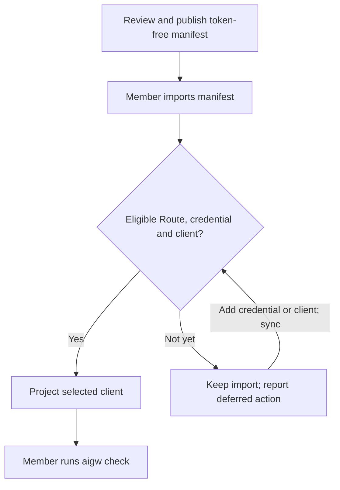

# Team Rollout

A team distributes reviewed public configuration; each member supplies Tokens
locally.



## Maintainer

1. Download the reviewed token-free
   [`manifests/team.toml`](../../manifests/team.toml).
2. Add only reviewed Account endpoints and admitted Profiles.
3. Keep Tokens, personal paths, identities, and release credentials out.
4. Validate the manifest in a clean repository environment.
5. Publish it through the team's ordinary configuration channel.

A manifest should contain the minimum Profile set users need. Provider catalogs
are discovery input, not automatic routing policy. Teams own model choice;
AIGW does not infer capability, quality or version policy from a model ID.
Adding a compatible model to an existing Account and admitted client changes
configuration, not the Adapter implementation. New client or authentication
boundaries follow [Adapter admission](../governance/adapter-admission.md).

### Manifest authoring contract

The team manifest is a curated catalogue, not a collection of personal notes.

| Field                | Responsibility                    | Team convention                                                                              |
| -------------------- | --------------------------------- | -------------------------------------------------------------------------------------------- |
| Profile ID           | Stable selection key              | Account ID + `-` + exact provider model ID, including channel suffix                         |
| `account`, `client`  | Credential owner and client scope | Explicit references to existing Accounts and admitted clients                                |
| `model`              | Provider request identifier       | Exact provider spelling, including version punctuation and channel suffix                    |
| `label`              | Human-readable identity           | `Account label · Model display name`; append `· CHANNEL` with a separating space when needed |
| `purpose`            | Optional workflow description     | Omit throughout this model catalogue                                                         |
| `recommended_routes` | Recommendation per client         | Sole recommendation owner, separate from display text                                        |

Use product capitalization, dotted display versions, uppercase channel names,
and spaces around `·`. Labels contain identity, not performance promises,
review status, or instructions. The catalogue assigns no workflow roles, so
every Profile consistently omits `purpose`; do not invent use cases to fill it.
Profile keys preserve provider spelling: `dmxapi-claude-fable-5-1` requests
`claude-fable-5-1`; its display label is `DMXAPI · Claude Fable 5.1`.
The `-cc` Profile is a separate channel, not the ordinary model.

Use the native `aigw config export` layout: version, recommendations, Accounts,
then Profiles; map keys follow stable lexical order and fields follow schema
order. Existing manifest tests check display structure and byte-identical
native export, without another formatter or model-name registry.

Verify exact provider identifiers before admitting models. A catalogue listing,
an authenticated protocol call, and a real-client journey prove different facts.
Recommendation readiness requires the latter two; a version name never proves
availability or capabilities. Missing evidence remains an open rollout task.

`aigw catalog` discovers Account catalogues; `aigw models` compares configured
Profile model IDs with the same observations. `Listed` and `Not listed` describe
catalogue membership only. Missing credentials, a failed request, an incomplete
response, or an absent catalogue endpoint remain explicit unknown observations,
not unavailable models. Neither command calls inference or proves native-client
readiness; use `aigw verify --for <client>` for the separate client proof.

### Reviewed model defaults

The catalogue contains GPT-6 Astra, GPT-5.6 Sol, Terra and Luna, Claude Fable
5.1, Opus 5 and Sonnet 5. DMXAPI's retained CC, SSVIP and CDX channels remain
separate Profiles within those model families; other Accounts use their
ordinary model identifiers. Channel names are not substitutes for the native
model selected in an existing Codex conversation.

The reviewed [DMXAPI public catalogue](https://rmb.dmxapi.cn/) lists ordinary
and CC Fable 5.1, ordinary/CC/SSVIP Opus 5 and Sonnet 5, and ordinary/CDX/SSVIP
GPT-5.6 Luna, Terra, Sol and GPT-6 Astra. All 20 entries are represented.
Luna CDX is marked supply-constrained; inclusion does not imply availability.
No Fable 5.1 SSVIP entry was listed in this observation.

The team recommends UCloud GPT-6 Astra for Codex and UCloud Claude Fable 5.1
for Claude Code. AIHubMix now includes those two models and uses the
[documented backup API domain](https://docs.aihubmix.com/en/quick-start),
`api.inferera.com`: `/v1` is the Responses base path; the Anthropic base is the
domain root. Its public model catalogue lists both identifiers. Listing and
configuration do not prove authenticated inference or real-client acceptance;
refresh that separate evidence before rollout.

The recommendation applies when its Account is connected. With another
Account, setup prefers the same model if that Account offers it, otherwise an
available Profile for that client. No provider Token is mandatory, and an
import preserves existing personal Routes.

Reasoning effort remains a native client preference, outside manifest schema
version 4. The team preference is `high`: set `model_reasoning_effort = "high"`
in the active Codex Home's `config.toml`, and `"effortLevel": "high"` in the
active Claude configuration directory's `settings.json`. Merge those fields
into existing settings; do not replace either document. Importing the team
manifest does not set these preferences.

Context capacity and compaction are also client settings. Retain the installed
client's model metadata unless the selected provider's larger limit has been
verified. A catalog listing or a successful short request does not prove a
full-window request will succeed.

### Client compatibility

Check `codex --version` or `claude --version` and run `aigw verify --for <client>`
before rollout. A provider may require a newer client even when an API request
works. Update through the existing installation owner rather than adding a
second executable. Claude Code's
[`stable` and `latest` channels](https://code.claude.com/docs/en/setup#update-claude-code)
are distinct; choose deliberately when compatibility requires a channel change.

A successful short request proves only that client, Profile and invocation.
It does not establish Desktop behavior, other operating systems, full-window
capacity, tool replay, or installation and update correctness. Verify those
journeys separately when the rollout depends on them.

## New member

Import the reviewed catalogue without requiring every provider Token or either
supported client:

```bash
aigw setup --from team.toml
```

Setup:

- validates all public metadata first;
- preserves every reviewed Account and Profile;
- connects no Account unless a Token already exists or the user selects one;
- configures only installed admitted clients;
- rolls back AIGW-owned changes if a required projection fails.

Connect any one Account; the rest remain optional:

```bash
aigw setup --from team.toml --account dmxapi
aigw check
```

The interactive command prompts only for the selected Account. Automation may
pipe exactly one Token by adding `--token-stdin`; it must keep `--account` so
the Token owner is explicit.

If the catalogue is already imported, use `aigw rotate <account>` to add or
replace that Account's Token, then select the desired Profile with
`aigw use <profile>`; the Profile itself declares its client. One connected
Account is enough to begin. Accounts without Tokens remain available but do not
make setup, check, or another Account fail.

Interactive `aigw use <profile>` can also prompt for that Account's missing
Token. Re-selecting the current Profile then reports **Token stored**, not an
unchanged operation. If the Token is already available and configuration is
unchanged, selection performs no writes. A cancelled or failed selection
compensates its own credential writes; it preserves a newer credential and
reports any incomplete recovery. An output error after commit does not undo
the selection. Run `aigw status` before retrying to inspect current state.

Rotation validates and replaces only the selected Account's Token. It does not
select a Profile, rewrite client configuration or invoke a native client. The
credential helper reads the new Token when next invoked; client caching may
require a reload. Use `aigw sync` for configuration changes. Failed storage
updates use guarded compensation, preserving newer Tokens rather than
overwriting them.

## Install a client later

Claude Code and Codex are not setup prerequisites. After installing either
client, run `aigw sync`; AIGW rediscovers supported clients and converges only
its owned configuration. Account-Token routes receive a credential helper;
client-native routes continue to use the client's own authentication:

```bash
aigw sync
aigw check
aigw verify --for codex
```

`aigw status` observes selection and projection readiness without client
execution or Token reads. `aigw check` adds endpoint checks; real-client
verification is separate. Configuration success alone is not authentication
or inference proof.

Optional balance credentials do not participate in `aigw check`, in either
human or JSON output. Use `aigw account connect <account>` to configure them
and `aigw balance <account>` to request provider diagnostics. An unavailable
balance service does not make a working client Route unhealthy.

Claude Code and Account-Token Codex routes use projection-matching helpers.
Changing Account or endpoint invalidates a retained helper invocation: run
`aigw sync` and reload the client's configuration. The helper does not return a
new Account's Token to a client retaining the old endpoint.

## Existing member

Preview before merging reviewed metadata:

```bash
aigw config import manifest.toml --dry-run --json
aigw config import manifest.toml
```

| Collision                          | Default behavior     | Explicit action                          |
| ---------------------------------- | -------------------- | ---------------------------------------- |
| Same semantic Account/Profile      | Reuse                | None                                     |
| Same ID, different public metadata | Stop before mutation | Review and use the specific replace flag |
| Local-only Profile not in manifest | Preserve             | Remove explicitly if obsolete            |
| Existing Token                     | Preserve             | Rotate explicitly if required            |

Import does not change Routes unless the command explicitly requests that
operation.

## Local choices

Do not edit the downloaded team manifest to encode a personal default, local
client path, or workstation-only endpoint. Import it as reviewed, then keep
local intent in AIGW's own configuration commands:

```bash
aigw use <profile>
aigw account edit <account> --openai-url <url>
aigw profile add <profile> --account <account> --for <client> --model <model>
```

`aigw use` changes only the named client's Route. Account and Profile commands
change local configuration and are not written back into `manifests/team.toml`.
To publish a team change, review the manifest itself and distribute the new
token-free revision.

## Release installation

GitLab and GitHub are independent release sources. Verify one complete artifact
set from one source; do not mix a tag, checksum file, and archive across Forges.

| Platform | Install asset                                  |
| -------- | ---------------------------------------------- |
| macOS    | Matching Darwin archive and checksum manifest  |
| Linux    | Matching Linux archive and checksum manifest   |
| Windows  | Matching Windows archive and checksum manifest |

After installation:

```bash
aigw --version
aigw sync
aigw doctor
aigw check
```

After upgrading, run `sync` from the active executable before resuming clients.
Before rolling back, list and disable enabled integrations through `adapter`
commands, then restore the program and run its `sync`. A predecessor may skip
projections written by a newer version when configuration values are unchanged.
Re-enable any explicit client locations and verify readiness. Configuration-schema
changes require a reviewed migration, not an implicit legacy reader or a claim
that restoring the executable restores all data.

## Staged rollout

| Stage           | Evidence                                                            |
| --------------- | ------------------------------------------------------------------- |
| Manifest review | Token-free diff and semantic validation                             |
| Pilot           | Clean install, setup, check, and rollback on each required platform |
| Team release    | Protected Forge publication and artifact verification               |
| Member adoption | Local setup/check results; no shared Token collection               |
| Closeout        | Deprecated manifest/profile references removed intentionally        |

## Automated rollout

Automated member setup may consume process-scoped environment Tokens. It
does not need access to a maintainer's native credential service. Repository
CI separately uses isolated fixtures under the
[quality and platform evidence policy](../governance/change-and-release-policy.md#quality-and-platform-evidence).

Set `AIGW_SECRET_BACKEND=env` and provide only the Accounts exercised by that
job. Environment names use `AIGW_TOKEN_<ACCOUNT>` with the manifest Account ID
uppercased and punctuation encoded by ASCII hex (`-` becomes `_2D`, `.` becomes
`_2E`, and `_` becomes `_5F`). This reversible mapping prevents two distinct
Account IDs from sharing a variable. The backend is deliberately read-only:
setup may consume present values, but rotation and deletion fail explicitly.
