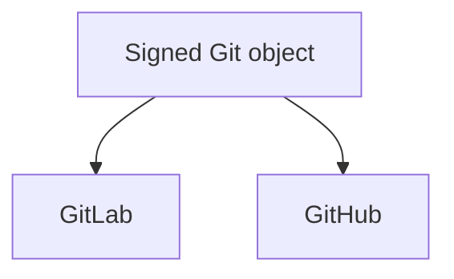

# Forge Operations

## Authority



Local Git is the only commit and annotated-tag authority. GitLab and GitHub are
independent optional publication peers. Neither peer is an input to the other.

| Concern                    | Authority                            |
| -------------------------- | ------------------------------------ |
| Commit and tag bytes       | Local Git                            |
| Product object trust       | Explicit allowed-signers file        |
| GitLab transport           | Git/SSH or GitLab credential context |
| GitHub transport           | Git/SSH or GitHub credential context |
| Hosted `Verified` display  | Each Forge account projection        |
| Release assets and records | Each selected peer, independently    |

Transport credentials never construct, rewrite, or sign product objects.

## Verify Local Objects

```sh
mise exec --locked -- go run ./tools/forge commits \
  --email "$AIGW_RELEASE_AUTHOR_EMAIL" \
  --allowed-signers "$AIGW_RELEASE_ALLOWED_SIGNERS_FILE"

mise exec --locked -- go run ./tools/forge tags \
  --allowed-signers "$AIGW_RELEASE_ALLOWED_SIGNERS_FILE"
```

## Publish a Branch

`main` publishes the same exact commit atomically to peer `main` and `dev`.
`proposal/*` publishes only its matching ref. No other branch is admissible.

```sh
mise exec --locked -- go run ./tools/forge project \
  --remote origin \
  --source main \
  --email "$AIGW_RELEASE_AUTHOR_EMAIL" \
  --allowed-signers "$AIGW_RELEASE_ALLOWED_SIGNERS_FILE"
```

A fast-forward or equal tip needs no destructive option. Every update carries
an exact lease for the observed remote tip, including expected absence. An
explicit `--expect-remote-tip` is checked even for a fast-forward or equal tip;
it is never ignored because the update appears safe. Concurrent remote drift
rejects the atomic publication instead of silently changing its admitted base.
A one-time divergent
cutover requires every fresh observed peer tip:

```sh
mise exec --locked -- go run ./tools/forge project \
  --remote github \
  --source main \
  --email "$AIGW_RELEASE_AUTHOR_EMAIL" \
  --allowed-signers "$AIGW_RELEASE_ALLOWED_SIGNERS_FILE" \
  --expect-remote-tip "main=$OLD_MAIN" \
  --expect-remote-tip "dev=$OLD_DEV"
```

The operator temporarily authorizes protected-branch force push, runs the exact
compare-and-swap transaction, verifies the two remote OIDs, and immediately
restores force push to disabled. A changed tip invalidates the prepared command.

## Publish a Tag

Create and sign an annotated tag once in local Git. Publish that exact tag
object independently:

```sh
mise exec --locked -- go run ./tools/forge publish-tag \
  --remote origin \
  --tag "$TAG" \
  --allowed-signers "$AIGW_RELEASE_ALLOWED_SIGNERS_FILE"

mise exec --locked -- go run ./tools/forge publish-tag \
  --remote github \
  --tag "$TAG" \
  --allowed-signers "$AIGW_RELEASE_ALLOWED_SIGNERS_FILE"
```

An equal remote tag is idempotent. A different object fails closed unless its
exact OID is supplied through `--expect-remote-tag` for an explicitly approved
cutover.

## Completion

### Verify published bytes on a native host

The read-only GitHub Release workflow accepts an existing release tag and a
bounded native runner choice. Its default remains Linux artifact verification.
Set `native_lifecycle=true` to additionally run the existing release lifecycle
against that host's published archive, after checksum, signature and source
verification. This does not publish, replace a tag or rebuild the candidate.
Separate runner selections can execute independently.

The bounded choices cover the six published OS/architecture pairs. Alongside
the ordinary Linux, macOS and Windows hosts, `ubuntu-24.04-arm`,
`macos-15-intel` and `windows-11-arm` execute the additional architectures.
Runner labels follow the [official image matrix](https://github.com/actions/runner-images#available-images);
the job must still demonstrate the actual host and candidate identity.

With `TAG` set to the exact published release, Windows ARM64 qualification uses:

```sh
gh workflow run release.yml --ref main \
  --field tag="$TAG" \
  --field runner=windows-11-arm \
  --field native_lifecycle=true
```

The selected tag and signed provenance identify the product bytes and their
build inputs. The selected workflow revision owns the verifier, tests and their
locked execution environment; it must declare the same product version, but
need not be the release commit. This permits stronger tests of an unchanged
published artifact without replacing its tag. The verifier checkout must be
clean, and artifact signature, checksum and tagged-source verification remain
mandatory. Native macOS and Windows journeys explicitly test
synthetic credentials on the disposable hosted machine. Linux's native Secret
Service still requires the separate isolated user-bus qualification. A queued
job, inspected archive or successful checksum does not prove native execution.
Real-client and live-Provider acceptance remain separate from this lifecycle.

### Observe publication and integration

Branch or tag publication is complete only when local Git and every selected
peer expose the same object OID. Hosted CI, Release records, assets, checksums,
installation, and runtime acceptance remain separate evidence boundaries.

For a review merge, read back the review state and exact target-ref OID. A
successful GitLab fast-forward may have no `merge_commit_sha` because no merge
commit was constructed. Require the target to equal the admitted signed object
and the merged proposal ref to be absent; a null merge-commit field alone is
neither failure nor completion.

Successful CI is distinct from enforced admission. Verify the native main/dev
rules require the intended checks and producer identity where supported, then
observe a real review blocked while checks are pending and admitted after they
pass. Preserve signature, history and force-push controls. An executed
maintainer merge does not prove a scheduled dependency updater; that automation
requires its own end-to-end observation.
