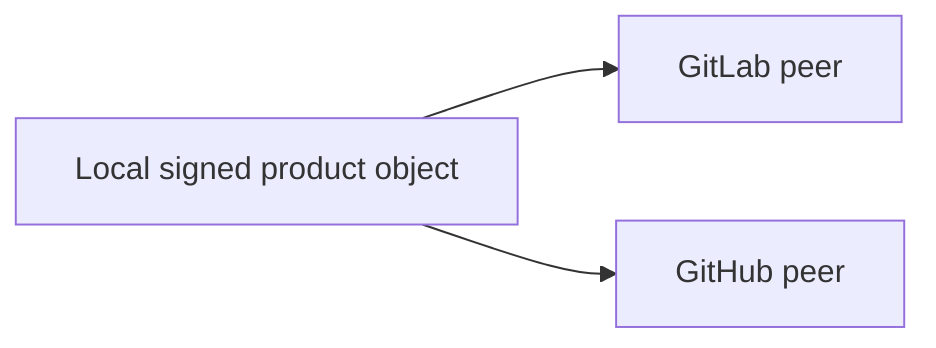

# Forge Operations

## Authority



Local Git is the only commit and annotated-tag authority. GitLab and GitHub are
independent optional publication peers. Neither peer is an input to the other.

| Concern | Authority |
|---|---|
| Commit and tag bytes | Local Git |
| Product object trust | Explicit allowed-signers file |
| GitLab transport | Git/SSH or GitLab credential context |
| GitHub transport | Git/SSH or GitHub credential context |
| Hosted `Verified` display | Each Forge account projection |
| Release assets and records | Each selected peer, independently |

Transport credentials never construct, rewrite, or sign product objects.

## Verify Local Objects

```sh
mise exec --locked -- go run ./tools/forge commits \
  --email "$AIGW_RELEASE_AUTHOR_EMAIL" \
  --allowed-signers "$AIGW_RELEASE_ALLOWED_SIGNERS_FILE"

mise exec --locked -- go run ./tools/forge tags \
  --allowed-signers "$AIGW_RELEASE_ALLOWED_SIGNERS_FILE"
```

## Publish a Branch

`main` publishes the same exact commit atomically to peer `main` and `dev`.
`proposal/*` publishes only its matching ref. No other branch is admissible.

```sh
mise exec --locked -- go run ./tools/forge project \
  --remote origin \
  --source main \
  --email "$AIGW_RELEASE_AUTHOR_EMAIL" \
  --allowed-signers "$AIGW_RELEASE_ALLOWED_SIGNERS_FILE"
```

A fast-forward or equal tip needs no destructive option. A one-time divergent
cutover requires every fresh observed peer tip:

```sh
mise exec --locked -- go run ./tools/forge project \
  --remote github \
  --source main \
  --email "$AIGW_RELEASE_AUTHOR_EMAIL" \
  --allowed-signers "$AIGW_RELEASE_ALLOWED_SIGNERS_FILE" \
  --expect-remote-tip "main=$OLD_MAIN" \
  --expect-remote-tip "dev=$OLD_DEV"
```

The operator temporarily authorizes protected-branch force push, runs the exact
compare-and-swap transaction, verifies the two remote OIDs, and immediately
restores force push to disabled. A changed tip invalidates the prepared command.

## Publish a Tag

Create and sign an annotated tag once in local Git. Publish that exact tag
object independently:

```sh
mise exec --locked -- go run ./tools/forge publish-tag \
  --remote origin \
  --tag "$TAG" \
  --allowed-signers "$AIGW_RELEASE_ALLOWED_SIGNERS_FILE"

mise exec --locked -- go run ./tools/forge publish-tag \
  --remote github \
  --tag "$TAG" \
  --allowed-signers "$AIGW_RELEASE_ALLOWED_SIGNERS_FILE"
```

An equal remote tag is idempotent. A different object fails closed unless its
exact OID is supplied through `--expect-remote-tag` for an explicitly approved
cutover.

## Completion

Branch or tag publication is complete only when local Git and every selected
peer expose the same object OID. Hosted CI, Release records, assets, checksums,
installation, and runtime acceptance remain separate evidence boundaries.
