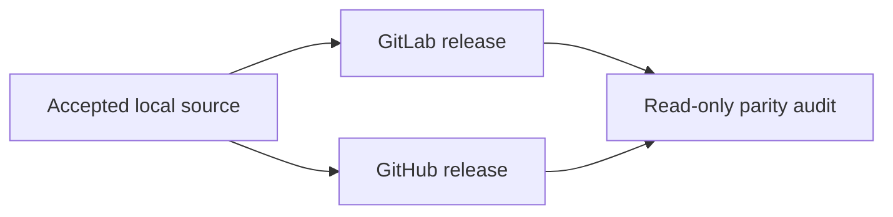

# Forge Operations

GitLab and GitHub are independent publication planes. Local development remains
complete without either one.



## Plane boundaries

| Plane | Owns |
| --- | --- |
| Local | Source, tests, build, candidate installation, runtime proof |
| GitLab | Provider-native commits, CI, tag, Release, assets |
| GitHub | Provider-native commits, CI, tag, Release, assets |
| Audit | Post-publication comparison only |

Neither Forge waits for, downloads from, authenticates to, or publishes through
the other.

## Source projection

GitLab carries the canonical commit identity. GitHub carries an equal-tree,
ordered history with its own provider identity and signature.

```bash
sh scripts/forge/lib/project-github-forge.sh
```

The projection is forward-only and fast-forward. It does not copy tags, force
push, rewrite canonical refs, or use user-global URL rewrites.

## Verification

Refresh only the required tracking refs, then run the offline checker:

```bash
git fetch --no-prune --no-prune-tags --no-tags origin \
  refs/heads/main:refs/remotes/origin/main
git fetch --no-prune --no-prune-tags --no-tags github \
  refs/heads/main:refs/remotes/github/main
sh scripts/checks/forge/check-forge-sync.sh \
  --canonical main \
  --peer gitlab:refs/remotes/origin/main:commit \
  --peer github:refs/remotes/github/main:tree
```

A stale tracking ref is not current remote evidence. Provider-native tags remain
in their own namespaces and are verified independently.

## Runners

A runner belongs to one `Forge × repository × platform × executor × purpose`
tuple.

- Verification and release privileges are separate.
- Descriptions identify the project and real host/executor role.
- Tags express required target capabilities.
- Jobs prove actual OS and architecture before build or package work.
- Runner absence or mismatch blocks the required job.
- A runner is not shared implicitly across repositories or Forges.

## Release

Each signed tag triggers the publishing Forge's own pipeline. The pipeline:

1. verifies provider-native commit and tag trust;
2. reads the exact Go patch version from `go.mod`;
3. builds the complete artifact matrix twice;
4. requires byte-identical results;
5. verifies checksums, SBOM, package layout, and platform evidence;
6. publishes or read-only verifies its own Release.

A one-sided outage leaves the other Forge usable. It does not authorize a false
dual-publication claim.

## Artifact parity

| Compared | Requirement |
| --- | --- |
| Version | Equal |
| Source | Equal tree and ordered history semantics |
| Common assets | Equal bytes and checksums |
| Provider signatures | Independently valid; not byte-equal |
| Provider-only metadata | Valid on its own Forge |

A released binary contains two independent update-source tuples. If both peers
are reachable, version and current-platform artifact bytes must agree. If one is
unreachable, the reachable peer may supply the complete verified update.
Authorization, malformed metadata, checksum, archive, downgrade, or redirect
failure remains terminal.

## Identity

Publication actors, emails, signers, keys, and trust anchors come from protected
execution context. Product source binds no individual contributor identity.
