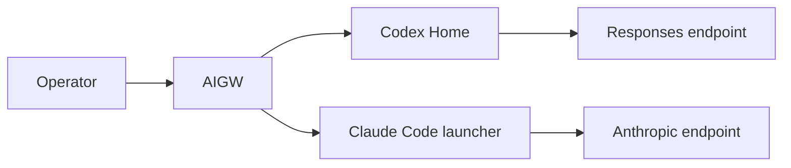
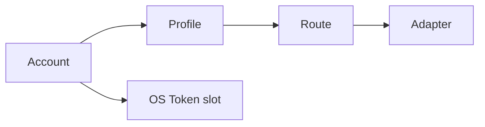
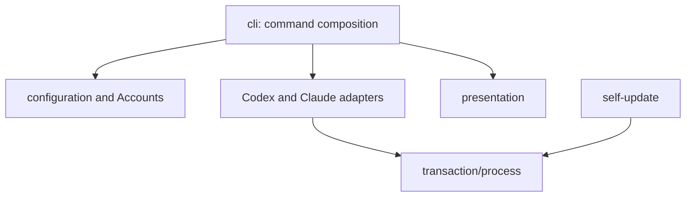
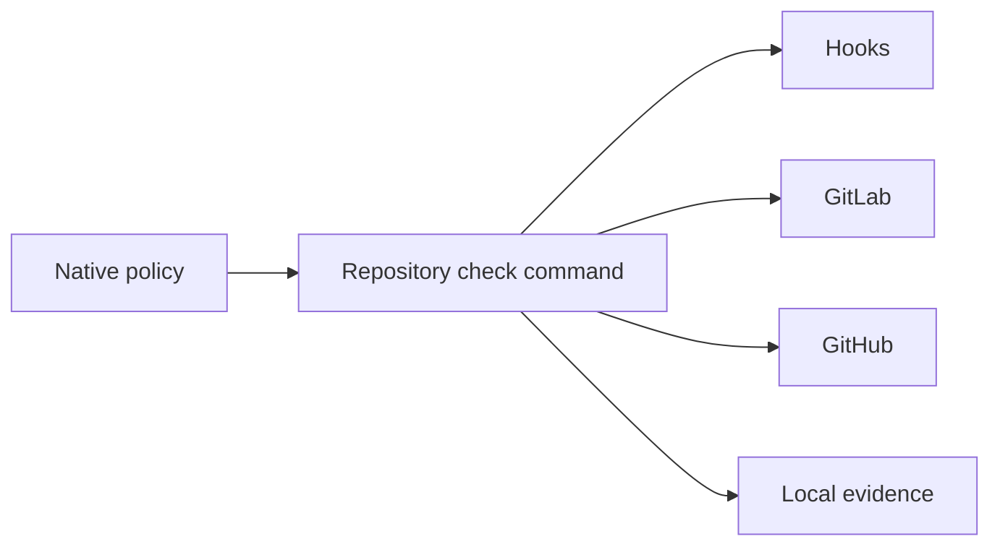
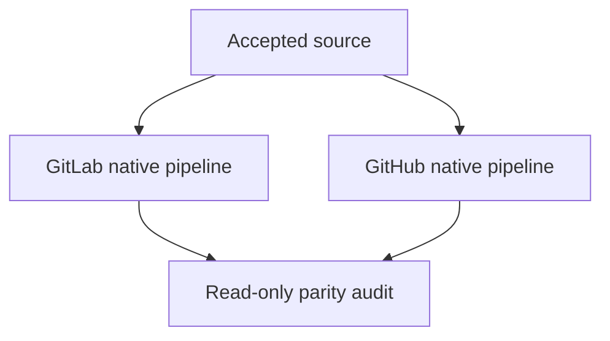

# Terminal Product Convergence Design

## 1. Product boundary

AIGW is a local-first enterprise control plane for third-party AI services. It
owns declarative Account, Token, Profile, Route, and native-client projection
state. It does not relay model traffic or own client conversations.



| Owner | Owns |
| --- | --- |
| AIGW | Accounts, Tokens, Profiles, Routes, admitted Adapter projections |
| Codex | Conversations, JSONL, SQLite, item state, model metadata, Desktop GUI |
| Claude Code | Session and client runtime behavior |
| External endpoint product | Traffic relay, retries, listener lifecycle |
| Each Forge | Its own CI, tags, Releases, and assets |
| Workstation / ETHOS | Generic host and repository governance only |

JetBrains, Air, Junie, ACP, and MCP are parallel products and outside this
change. AIGW currently admits Codex and Claude Code only. Hermes and future
clients remain designed extension points, not implementation scope.

## 2. Product model



| Entity | Contract |
| --- | --- |
| Account | Provider endpoint set and one logical Token boundary |
| Profile | One explicit `account + client + model` daily choice |
| Route | Default or client-specific Profile selection |
| Adapter | Projection into exactly one admitted native client |

Provider identity never acts as a hidden behavior switch. An ordinary provider
is configuration data. Provider-native balance/account diagnostics are optional
leaf capabilities and cannot become setup, routing, projection, or verification
dependencies.

## 3. Client adapters

Codex and Claude Code implement one adapter contract:

- presence and supported-version discovery;
- configuration or process planning;
- least-scope credential binding;
- guarded mutation and byte-exact rollback;
- bounded explicit verification;
- status and diagnostic contribution;
- uninstall of only AIGW-owned state.

Common workflows iterate the admitted registry rather than spread client-name
switches across commands. A synthetic future adapter must have a local change
radius without implementing another client.

### Codex

Codex CLI and Desktop share one Codex Home. AIGW owns only its marked provider
and model projection, sidecar, and native credential binding. It never edits
conversation or Desktop-only state.

The projection declares Codex's own scheduler bound:

```toml
[agents]
max_concurrent_threads_per_session = 16
max_depth = 1
```

The external endpoint remains session-agnostic; AIGW does not impose a proxy
global queue.

### Claude Code

The AIGW launcher injects the selected Anthropic endpoint, model, and Token into
one launched process. No plaintext Token is written to a shell profile or shared
configuration.

### Missing clients

Setup and repair touch only admitted clients whose required executable and
surface are present. Missing and foreign clients remain untouched.

## 4. UX and DX

| Surface | UX | DX |
| --- | --- | --- |
| Entry | Installed `aigw` | Repository-owned Go and quality commands |
| Goal | Configure, select, inspect, recover | Build, test, analyze, package, publish |
| Output | Task-first human view or explicit JSON | Reproducible diagnostics and artifacts |
| Environment | No source checkout required | Repository module, lock graph, isolated tools |

Daily UX remains:

```text
aigw setup
aigw use
aigw check
```

Human output answers selection, readiness, and the next safe action. One result
model feeds human and JSON views. Lip Gloss remains the sole visual engine;
display-width alignment, responsive layout, CJK, colorless output, and golden
80/100/120-column snapshots are enforced. No second TUI framework is added.

Expected failures do not emit an unexpected traceback, warning, or usage banner.

## 5. Semantic physical structure

The final codebase is organized by product semantics, not generic layers.



Target owners:

| Owner | Responsibility |
| --- | --- |
| `configuration` | Account, Profile, Route, Adapter schema and persistence |
| `secrets` | Token backends |
| `codex` | Codex projection and credential plan |
| `claude` | Claude launcher and process plan |
| `providers` | Optional provider-native diagnostics only |
| `presentation` | Human projection of command result models |
| `transaction` / `process` | Guarded effects and bounded execution |
| `selfupdate` | Dual-source update verification and installation |
| `cli` | Cobra composition and task orchestration only |

`internal/cli` currently imports too many semantic packages. Commands are
reduced to thin compositions over cohesive owners. Generic buckets, forwarding
facades, re-export packages, aliases, duplicated orchestration, and one-caller
abstractions are removed unless independently justified.

Tests mirror the same semantic owners. Architecture gates enforce dependency
direction, fan-in/fan-out, ELOC, complexity, duplication, hard-coding, and zero
compatibility residue.

## 6. Documentation system

| Owner | Subject |
| --- | --- |
| `README.md` | Product and user journey |
| `CONTRIBUTING.md` | Developer workflow and quality graph |
| `docs/concepts/` | Entity semantics only |
| `docs/architecture/` | Boundaries and dependency direction |
| `docs/governance/` | Current invariants |
| `docs/guides/` | Task-oriented team adoption |
| `docs/operations/` | Forge and release procedures |
| `docs/decisions/` | Durable decisions |
| `docs/evidence/` | Claim limits |
| `openspec/changes/archive/` | Immutable history |

`docs/README.md` is the unique registry. Current documents do not repeat the
same concept, release procedure, or boundary. Mermaid expresses relationships;
tables express ownership and comparison; lists express rules; code blocks
express exact commands. ASCII arrows and prose walls are rejected.

Markdownlint and Lychee prove Markdown syntax and all internal/external links.
Current documentation is English-only. Archive and dated evidence are preserved
as history and removed from current navigation when superseded.

## 7. Quality architecture

Every concern has one policy owner and one reusable command owner. Hooks and CI
are projections.



| Concern | Owner/tool |
| --- | --- |
| Format | `gofmt` |
| Static correctness | `go vet`, Staticcheck, Errcheck |
| Tests and race | `go test -race` |
| Statement coverage | Repository coverage gate; aggregate and each package strictly above 95% |
| Architecture and portability | Repository architecture tool |
| Markdown | markdownlint-cli2 |
| Links | Lychee |
| Shell | ShellCheck and shfmt |
| GitHub workflows | actionlint and Zizmor |
| Secrets | Gitleaks |
| Go vulnerabilities | govulncheck |
| SBOM | Existing deterministic SBOM owner |
| Complexity and duplication | Architecture gate plus `scc` trend evidence; add a tool only for an uncovered distinct metric |
| CLI UX | Golden, width, no-color, JSON, and black-box package tests |
| Docs registry | Unique subject and link graph checker |

No concern is duplicated in CI YAML. Existing scripts are consolidated into a
small task graph; one wrapper per concern is acceptable, not dozens of parallel
policy surfaces.

## 8. Supply chain

`go.mod` owns the latest stable Go toolchain and direct dependencies. `go.sum`
owns the resolved module graph.

- Direct and transitive stable updates are evaluated together.
- Pseudo-versions are retained only when required by a direct stable dependency;
  arbitrary moving commits are not selected manually.
- Update candidates pass format, vet, static analysis, race, coverage,
  architecture, package, install, and cross-platform gates.
- CI derives the exact Go patch version from `go.mod`.
- Shell and Python remain only for intrinsic packaging or Forge boundaries and
  use repository-declared tools; no ambient ETHOS or system Python environment
  satisfies project verification.

## 9. Local-first and independent Forges

Local source verification, packaging, candidate installation, and runtime
acceptance do not require a remote.

GitLab and GitHub publish independently:



Neither Forge invokes, authenticates to, waits for, or downloads from the other.
When both are reachable, update requires equal version and current-platform
artifact bytes. When one is unreachable, the other may supply its own complete
verified update.

Runner identity is truthful. A runner belongs to one
`Forge × repository × platform × executor × purpose` boundary. Jobs prove actual
OS and architecture. Missing capability blocks; it is not an allowed failure.

## 10. Lane semantic convergence

The `terminal-product-convergence` lane owns the terminal design. The
`runner-admission` lane contains two independent semantic sets:

- portable client-control-plane work overlapping terminal convergence;
- unique GitLab managed-runner admission changes.

The first is compared path-by-path and absorbed only where stronger or missing.
The second must be reimplemented or cherry-picked under the terminal owner with
its CI contract tests. No lane is deleted based on cleanliness alone.

Every other lane, branch, lease, and worktree is classified as required unique,
already represented, obsolete, or unknown. Only the first three can converge;
unknown facts remain retained until resolved.

## 11. Archive lifecycle

Archive is immutable history, not a current task queue or authority. Existing
AIGW archive directories have no unchecked tasks and no detected post-archive
markers, but their canonical-spec coverage and current navigation still require
verification.

A change may archive only when:

- material semantics exist in canonical specs;
- required source/tests/docs are complete;
- remaining publication and runtime claims have explicit owners;
- archival does not make an incomplete task appear complete.

## 12. Acceptance

Completion requires current evidence for:

- provider-neutral configuration and optional diagnostics;
- cohesive Codex/Claude adapters and bounded future-client extension;
- correct Codex scheduler projection and no provider/proxy concurrency coupling;
- clean semantic package and test structure;
- task-first responsive UX and stable JSON;
- complete quality graph and strictly above 95% aggregate/package coverage;
- latest stable supply chain and vulnerability proof;
- native macOS, Linux, and Windows package lifecycle;
- local-first build/install/runtime;
- independent GitLab/GitHub green release and parity;
- native Codex through Proxy to UCloud, DMXAPI, AIHubMix, native Claude Code,
  and original-conversation continuity without session mutation;
- every lane semantic delta absorbed or explicitly rejected before closeout;
- clean canonical roots and deep housekeeping.
