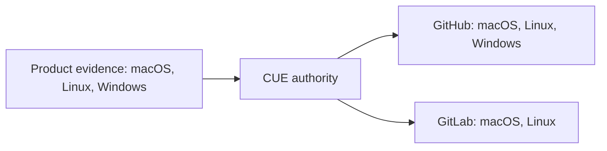

# Design

## Model

The CUE authority separates two facts:

| Fact | Meaning |
| --- | --- |
| Product evidence | Native operating-system evidence required for AIGW |
| Forge capacity | Native executors currently admitted on one Forge |

GitHub currently supplies the complete product-native set. GitLab projects
only macOS and Linux until a qualified Windows runner is admitted. Generated
Forge files remain deterministic projections, never independent policy.

## Projection

Adding a future GitLab Windows executor changes one capability declaration;
the same generator then restores the job without a compatibility flag or a
second workflow definition.
