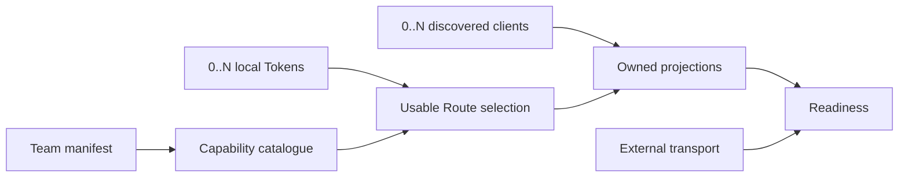

## Context

The current setup transaction conflates five independently evolving facts:
reviewed catalogue data, locally held Tokens, selected Routes, installed
clients, and reachable transports. The all-or-nothing coupling is especially
visible on Windows, but the defect is platform-independent.

## Terminal model

| State | Authority | Required during import |
| --- | --- | --- |
| Accounts and Profiles | reviewed manifest | yes |
| Tokens | OS credential backend or environment | no |
| Routes | local AIGW configuration | a valid recommendation, activation may defer |
| Client presence | host discovery | no |
| Projection | AIGW synchronization | only for discovered clients |
| Endpoint health | selected protocol endpoint | only when the selected installed client is checked |

## Decisions

1. Configuration owns deterministic profile matching. A connected Account may
   replace a recommended Route with a profile for the same client and model;
   otherwise its first stable client profile is used.
2. Onboarding owns only orchestration. It imports the catalogue, observes or
   explicitly collects selected credentials, asks discovery for present
   clients, and commits one compensated transition.
3. Manifest setup accepts an explicit Account selection. Interactive setup may
   connect one Account or defer; non-interactive setup imports without requiring
   implicit secret input. `--token-stdin` is unambiguous only with one selected
   Account.
4. Recovery owns rediscovery. Normal `sync` uses the same desired-client
   derivation as repair, so installing a client later needs no second semantic
   implementation.
5. The canonical team manifest selects each provider's native Responses URL so
   AIGW remains independently usable. A separate deployment composition may
   select a direct, loopback, or remote compatible URL. AIGW treats every form
   as endpoint data and never infers the implementation from its host, port,
   path, or deployment topology.
6. Presentation reports facts by lifecycle stage. “Imported” never means
   “connected”, “projected”, or “ready”.

## Failure and compensation

- Invalid public metadata fails before secret reads.
- Credential validation covers only selected Accounts and discovered clients.
- A failed Token write, projection, or native authentication bind restores the
  exact AIGW preimage.
- An unreachable optional endpoint does not block catalogue import. It becomes
  a readiness failure only when a present client selects that Route.

## Verification

The regression ladder covers pure configuration selection, CLI acceptance,
late client discovery, native Windows setup with isolated homes and environment
credentials, full source quality, exact release assets, install/setup/check,
and uninstall residue. Synthetic endpoints prove deterministic CI behavior;
real-machine verification remains the authority for a live provider and client.
