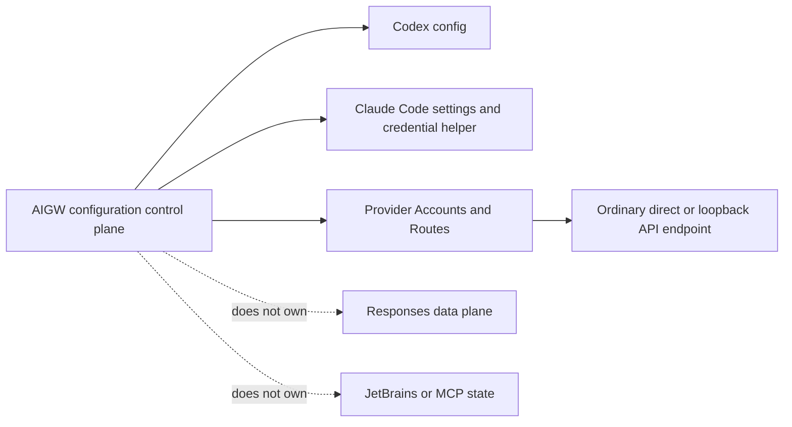

# Design

## Product boundary

Core configuration owns provider-neutral Accounts, credentials, Profiles, and
Routes. Each client adapter owns only its public projection contract. Provider
diagnostics are optional registrations, never client behavior.

## Lane absorption

For every historical lane:

1. Compare product paths with current `dev`.
2. Identify a concrete missing behavior and its existing semantic owner.
3. Rebuild it test-first in this lane only if it reduces the final gap.
4. Discard duplicate OpenSpec carriers, version noise, compatibility wrappers,
   and project-external governance.

No historical tree is merged wholesale.

## Structure and dependencies

| Concern | Owner | Rule |
| --- | --- | --- |
| Configuration model | `internal/configuration` | One provider-neutral SSOT. |
| Codex projection | `internal/codex` | CLI and Desktop shared-home semantics only. |
| Claude Code projection | `internal/claude` | Official settings and credential helper only. |
| Provider diagnostics | `internal/providers` | Optional registry entry with no client coupling. |
| CLI UX | `internal/cli` | Product commands; no shell wrapper or hidden Python dependency. |
| Release | `tools/release` | Same source, independently verified Forge assets. |

A mature dependency is admitted only when it deletes more ELOC, accidental
complexity, or platform risk than it introduces. No dual stack remains.

## Delivery boundary

Local proof and release assembly complete without a remote. GitLab and GitHub
are peer publication planes: either can publish the same signed revision and
neither is an input to the other. Runtime installation consumes formal assets,
not a source checkout or another product.

## Verification

Completion requires statement, branch, package, and aggregate coverage strictly
above 95%; native macOS, Linux, and Windows gates; cross-platform artifacts;
clean Codex and Claude Code projection; independent Forge publication; formal
installation; and owner-bound retirement of every superseded lane.
